# Jen buď EPIC

2025/12

Kompetitivní hra o boji s příšerami pro 2 - 4 hráče.

Přišel jsi do kraje, protože tě lidé potřebují. Každý tvůj krok je epickým bojem s příšerami. Místní si o tobě i po letech budou šeptat. Ale nejsi tu však sám. Budeš ty nakonec ten nejvíc EPIC?

## Myšlenka hry

Hrdinové se střídají v tazích. Karty artefaktů a legendárních zbraní se ti na ruce míhají jedna za druhou. Posouváš svou figurku po mapě a čistíš krajinu od příšer. Tahy jsou rychlé, ale promyšlené. Bojem a plněním úkolů získáváš body slávy, a až jich získáš dost, vyhraješ.

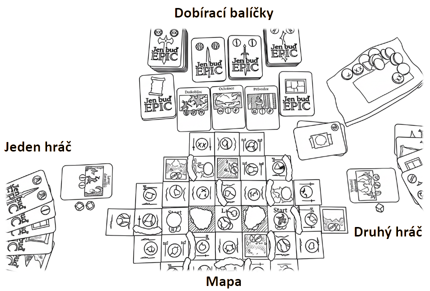

## Herní prvky – na ruce

Držíš karty zbraní, artefaktů a úkolů. Užitek ti přinesou až po jejich zahrání. Všechny jsou tajné a nikomu je neukazuj, pokud ti to pravidla vyloženě nenařídí.

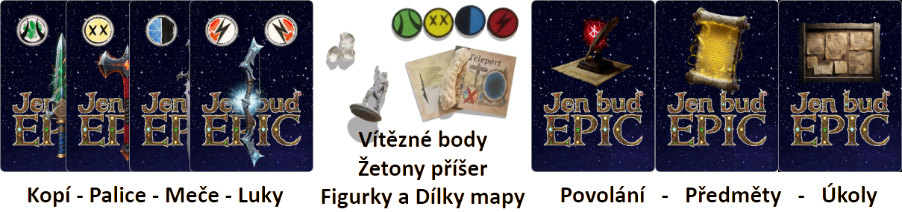

## Herní prvky – na stole

Před sebou máš hromádku získaných žetonů slávy a karet splněných úkolů. A trofeje, to jsou žetony příšer, které jsi v nedávné době porazil. Jsou důležité k plnění některých úkolů.

## Herní prvky – mapa

Uprostřed stolu je rozložená mapa. Na ní stojí vaše figurky a leží žetony příšer a slávy. Vše, co je na mapě, kde kdo stojí a jaké příšery jsou v jeho okolí, je veřejné. Žetony slávy na mapě zatím nikomu nepatří. Získá je ten z vás, který se k nim dostane jako první.

## Herní prvky – nabídka

Vedle mapy jsou dobírací balíčky karet. Jsou tu čtyři druhy zbraní (kopí, palice, meče a luky), a také balíčky úkolů a artefaktů. Dál jsou tu lícem nahoru otočené tři karty současných veřejných úkolů a odkládací balíček zahraných karet.

## Herní prvky – zbylé žetony

Nepoužité žetony příšer čekají v losovacím váčku.

## Od zbraně k příšeře

Ve hře EPIC můžeš každou příšeru porazit konkrétní zbraní. Podobně jako na zvířata platí kopí, na nemrtvé zase funguje palice. Nemusíš si to pamatovat, je to na rubu dobíracích hromádek. Pátou zbraní jsou bomby. Ty působí na všechny příšery bez rozdílu.

X: I na líci každé zbraně vidíš, na kterou příšeru bude fungovat.

X: Zbraně jsou v každém balíčku namíchané. Když dobereš zbraň z balíčku luků, nemusí to být nutně luk ale často by měl být.

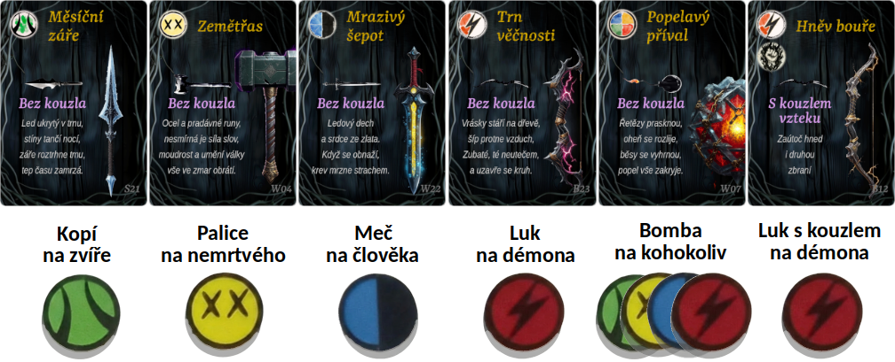

## Příprava hry

Vyberte začínajícího hrdinu. Bude mít oproti ostatním malou výhodu, tak vyberte někoho méně zkušeného. Hrajte po směru hodinových ručiček, takže hrdina napravo od začínajícího bude hrát poslední. Jako kompenzaci ho jmenujte velitelem mapy. Na začátku hry tento velitel doprostřed stolu sestaví mapu. Tady je pár možných tvarů mapy. Jeden si zvolte.

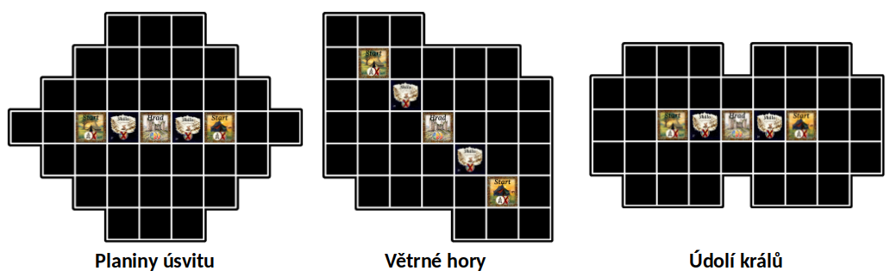

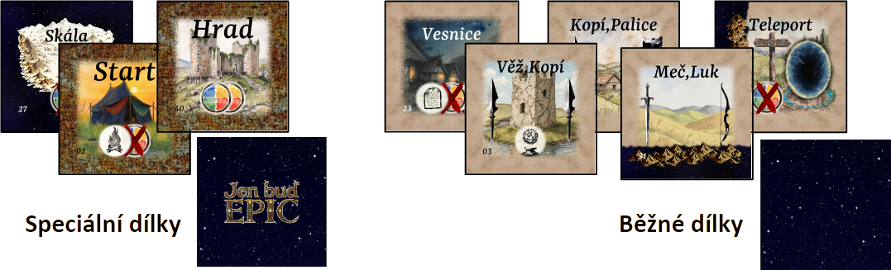

Veliteli, vezmi 5 speciálních dílků (hrad, dvě skály a dva starty) a odlož je stranou. Zbytek dílků zamíchej. Speciální dílky dej jak jsou na obrázku mapy. Ostatní dílky dej náhodně, postav z nich vybraný tvar. Dílky pokládej lícem nahoru a při pokládání je náhodně otáčej. Teď se podívej, jak jsou umístěné hřebeny hor, jestli náhodou není nějaké políčko izolované. Pokud ano, tak otoč co nejméně dílků tak, aby byla všechna pole opět dostupná. Ty rozhodneš, které dílky a jak pootočit. Přidej miniatury skal a hor, aby byla mapa více přehledná. Tím tvá zodpovědnost končí.

X: Hru připravujete všichni spolu, ale o mapě rozhoduje velitel mapy.

[tabulka: NEDOVOLENÉ SITUACE MAPY]

Dál tahej z váčku náhodně příšery. Na každé políčko vylosuj jednu. Výjimkou je hrad, kde mají být příšery dvě. A pole, na která se příšery neumisťují, což je start, skála, vesnice a teleport. Na každou příšeru polož žeton slávy.

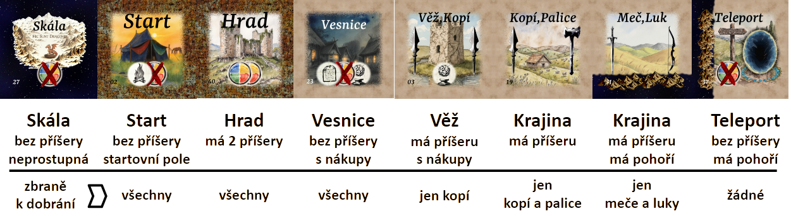

Zbylé příšery vrať do váčku a zbylé žetony slávy do krabice, už je nebudeš potřebovat. Připrav a zamíchej všech šest dobíracích balíčků karet: kopí, palice, meče, luky, artefakty a úkoly.

Každému hrdinovi vylosuj kartu povolání a dej mu kartu "Jsi EPIC". Od začínajícího hrdiny si každý vybere, na kterém ze startů chce začínat. Vybírej podle toho, kde je lepší terén, je méně skal, bohatší nabídka příšer či menší konkurence ostatních hrdinů.

X: Ano, můžete klidně začínat všichni na stejném startu.

X: Ano, když vybíráš kde budeš začínat, ještě nevíš jaké jsou úkoly, znáš pouze kartu povolání. Úkoly budou překvapení pro všechny.

Pozor, teď budeš vybírat počáteční zbraně. Špatný výběr ti může ztížit start hry. Nejdřív si přečti, jak se zbraně používají, viz "Tah hrdiny" a pak teprve dokonči přípravu.

Každému hrdinovi vylosuj osobní úkol a jednu kartu artefaktu. A teď si postupně od začínajícího hrdiny každý doberte své dvě počáteční zbraně. Na políčku start si můžete dobrat z kterých hromádek chcete, klidně každou z jiné.

H: Cesta za slávou je trnitá. Že luk na kostlivce nefunguje, už teď snad víš.

X: Druhou zbraň se často vyplatí si brát, až když vidíš co sis doopravdy vytáhl jako tu první.

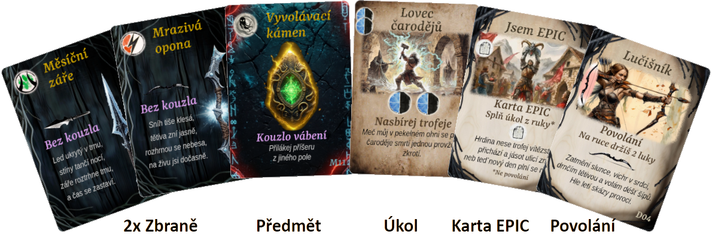

Nakonec otoč a vylož tři karty úkolů, jako veřejnou nabídku, a hra může začít.

## Tah hrdiny

Ve svém tahu provedeš několik akcí v tomto pořadí. Je to jednoduché!

**Najdi cíl**. Podívej se na karty zbraní, které držíš v ruce, a na příšery na sousedních polích. Najdi příšeru, proti které máš správnou zbraň.

H: Ideálně si vyber takovou, která má u sebe ještě žeton slávy.

**Zaútoč a získej odměnu**. Odhoď kartu použité zbraně. Posuň svou figurku na dobyté pole. Vezmi si poraženou příšeru jako trofej a její žeton slávy si polož před sebe.

H: Když v ruce držíš palici. Na sousedním poli vidíš nemrtvého. Zahodíš palici, přesuneš se na jeho pole a vezmeš si žeton slávy i žeton nemrtvého jako trofej.

**Nákup**. Přišel si do vesnice nebo do věže? Pak teď můžeš nakoupit speciální karty.

**Dober zbraň**. Vyber si zbraň podle toho, co je nakreslené na tvém novém poli mapy. Dober si z příslušné hromádky.

**Zkontroluj úkoly**. Podívej se na své karty úkolů (osobní i veřejné). Pokud splňuješ podmínky některého z nich (např. máš potřebné trofeje), můžeš ho nyní splnit. Splněné úkoly si vylož před sebe.

**Konec tahu**. Pokud se uvolnilo místo ve veřejné nabídce úkolů, doplň ji na tři karty. Tím tvůj tah končí. Pokud jsi ještě nevyhrál, pokračuje další hráč po směru hodinových ručiček.

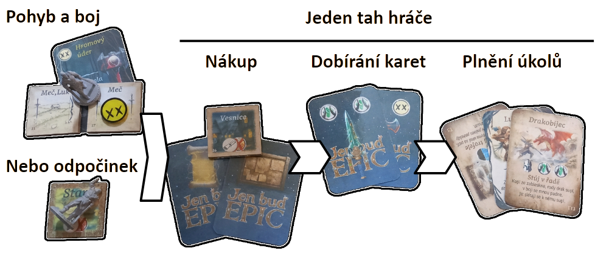

## A1 - Fáze pohybu

První fáze tvého tahu je pohyb. Přesuň figurku podle pravidel po mapě. Pokud se pohybuješ, musíš vždy zahodit zbraň, i když ji třeba nepoužiješ. Na políčko s příšerou nemůžeš vstoupit, dokud ji neporazíš.

H: Naběhl jsi tam a mlátil tou palicí kolem sebe, až se rozbila. Nikdo tam nebyl, tak tomu říkejme trénink, ano?

X: Ano, zbraň zahazuješ, i když jdeš na pole, kde žádná příšera není, nebo třeba do vesnice.

X: Ostatní hrdinové tě v pohybu nijak neomezují. Klidně s nimi buď na stejném poli.

### Pravidla pohybu po mapě

Posouváš figurku na jiné políčko mapy. V základu s ní táhneš o jedno políčko vodorovně nebo svisle. V cestě ti nesmí stát hřeben hor, to je vždy nepřekonatelná překážka, pokud tedy nepoužiješ kouzlo letu (viz "Používání kouzel"). Pokud je na políčku příšera, můžeš na něj vstoupit, pouze pokud máš vhodnou zbraň, abys ji porazil (viz "Od zbraně k příšeře").

**Políčko start** je místo kde máš s ostatními hrdiny svůj stan. Příšery se sem bojí, nikdy tu žádná nebude.

X: To, že tu nikdy příšery nebudou, není technicky vzato pravda. Na každé políčko, tedy i sem, můžeš přivolat příšeru kouzlem vábení.

**Políčko vesnice**, tady bydlí místní. Příšery sem nechodí, ale ty můžeš. Je tu řada krámů které můžeš prozkoumat (viz "Fáze nákupu").

**Políčko věž** má ukrytou truhlu s artefaktem. Příšera tu normálně je, ale když jí porazíš, můžeš truhlu prozkoumat (viz "Fáze nákupu").

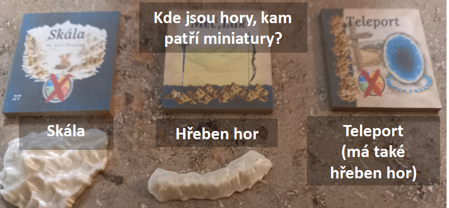

**Políčko teleport** je výjimečné. Na něm nemůžeš stát a nikdy na něm není žádná příšera. Když na něj vstoupíš, okamžitě vystoupíš na libovolné políčko sousedící s kterýmkoliv teleportem na mapě. Ovšem za to nové políčko pořád musíš odevzdat zbraň, jako při normálním pohybu po mapě. I tady nesmíš jít přes hřebeny hor.

X: Ať je to úplně jasné, za průchod teleportem odevzdáváš jednu zbraň a to podle toho nového pole na které vystoupíš.

X: Stále nemůžeš zůstat při pohybu na stejném políčku mapy, musíš vystoupit z teleportu na jiné pole.

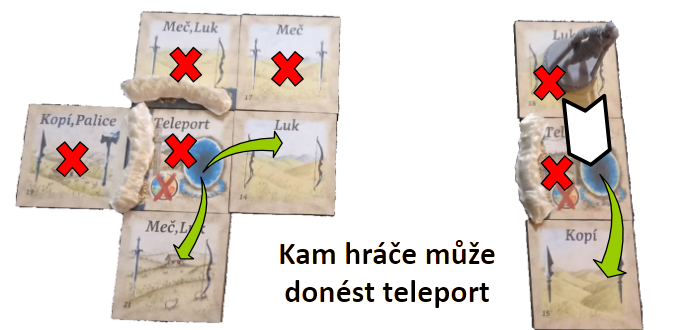

H: Skoro to vypadá, jako by tvým největším nepřítelem byly hory. S tím co vše do boje táhneš, se vlastně není čemu divit.

**Políčko skála** je také výjimečné. Přes něj se prostě chodit nedá. Nijak. Ani příšery se sem neodváží.

H: Tady někde žije hodně velký drak.

**Políčko hrad** se tyčí nad okolní krajinou. Prastará zřícenina, na které straší hned dvě příšery zároveň. Zlikviduj je, a čekají tě dva žetony slávy najednou. Ale potřebuješ porazit obě příšery naráz. Nejde porazit jen jednu, musíš je porazit obě společně.

X: To znamená, že na hrad můžeš pouze pokud máš zbraně na poražení obou příšer, co tam jsou. Na každou zbraň je dovoleno použít kouzlo, ale není to povinné. Na tomto políčku jsou příšery tak blízko u sebe, že budeš bojovat s oběma zároveň, i kdybys žádná kouzla nepoužil.

X: Je běžné použít jednu zbraň s kouzlem tvrdosti nebo dvě různé zbraně.

H: Místní už si o tobě začínají šeptat.

## A2 - Fáze odpočinku (v pokoji)

Pokud se nemůžeš nebo nechceš posunout, odpočíváš (v pokoji). Povinně zahoď z ruky všechny své zbylé zbraně. Odpočívej tam, kde jsi, nebo se přesuň na libovolné políčko start. S tebou odpočívají i příšery, takže se teď na mapu doplní žetony příšer.

H: Dobrý důvod k odpočinku je například to, když ti jiní ukradnou i poslední zbraň.

H: Když odpočívá hrdina, odpočívají i příšery.

X: Odpočívat můžeš i dobrovolně.

Teď na všechna volná pole mapy doplň z váčku novou náhodně vylosovanou příšeru. Nedoplňuj je na hrad, starty, vesnice, teleporty či skály a také ne na místa, kde stojí nějaký hrdina. Losování dělá za odměnu odpočívající hrdina, ale může to delegovat, pokud mu je ochotný někdo pomoci. Na nové příšery už nedávej nové body slávy.

H: O nových příšerách ještě místní nevědí, takže za ně žádná sláva nebude.

H: Na hradě už jsi to vymlátil. Teď se tam příšery bojí.

H: Pokud chceš, aby nové příšery vylezly z úkrytů, musíš být chvíli opravdu, ale opravdu potichu.

X: Nikdy nedávej nové příšery na hrad, start, vesnici, skálu nebo teleport. (Kromě hradu je to na nich nakreslené)

X: Nikdy nedávej novou příšeru na pole kde stojí nějaký hrdina.

## B - Fáze nákupu (byl jsi ve vesnici nebo ve věži?)

Ve věži a ve vesnici můžeš získat nové kouzlo, ve vesnici navíc i kartu úkolu. Ať už se pohybuješ, nebo odpočíváš, pokud jsi přišel na takové pole, prošel přes něj nebo na něm odpočíváš, tak tam teď nakup.

H: Jsou i tací, co při odchodu z vesnice zjistí, že se jim odtamtud vlastně zas tak moc nechce, a daší den si tam v hostinci odpočinou.

X: Když máš dvě zbraně a kouzlo zuřivosti, můžeš vesnicí i jen proběhnout a přesto stihneš nakoupit.

X: Zato když tě sem v noci někdo teleportuje kouzlem záměny a ty jen ráno sebereš svůj ranec a utečeš, nakoupit už nestihneš.

**Ve věži i ve vesnici.**
- Dober si novou kartu artefaktu.

**Ve vesnici** navíc můžeš dělat toto (klidně oboje).
- Jednu kartu z vyložené nabídky úkolů zahoď na odhazovací balíček.
- Jednu kartu z vyložené nabídky úkolů nebo novou náhodnou si vezmi na ruku jako svůj další osobní úkol.

H: Za poflakování po hospodách sláva není, jsi hrdina, a ne bard. Ale dají se tu doplnit zásoby.

H: A hele, vývěska "Hledá se hrdina". Tenhle letáček ostatní vidět nemusí, vezmu si ho, děkuji.

X: Z veřejné nabídky můžeš tedy odstranit až dvě karty úkolů.

X: Na počet artefaktů ani karet úkolů v ruce není žádný limit, můžeš jich mít, kolik chceš.

## C - Fáze dobrání karet zbraní

Teď si dober nové zbraně. Vždy tak, abys měl na ruce dvě. První zbraň ber z hromádky zbraní podle pravidel políčka mapy. Co máš na výběr je nakreslené přímo na políčku mapy. Pokud ti chybí i druhá zbraň, tak si ji dober z libovolné hromádky zbraní bez omezení.

X: Pokud ti nechybí žádná, nedobírej si.

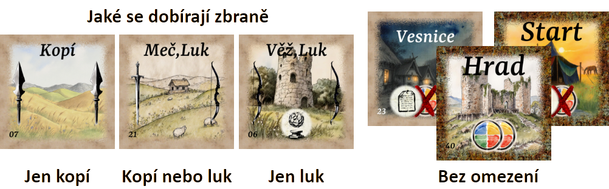

Pokud jsi na políčku start, hrad, nebo vesnice, tak tam žádné omezení na zbraně není.

**Pozor vyjímka**. Pokud si zahrál kouzlo krádeže, tak ti to umožňuje zbraň určenou polem nebrat z balíčku, ale místo toho ji ukrást z ruky libovolného hrdiny (viz "Kouzla").

Na konci tahu také musíš zahodit nadbytečné trofeje. Můžeš si nechat maximálně tři. Dobře zvaž, které se ti ještě budou hodit k plnění úkolů a které už ne. Trofeje získáváš poražením příšery (viz "A1 - Fáze pohybu") a potřebuješ k plnění úkolů (viz "O úkolech").

H: Nikdo s sebou netahá všechno a nikoho nezajímá, co jsi zapíchnul před půl rokem.

## D - Fáze plnění úkolů

Teď, když máš akci za sebou, podívej se na nabízené úkoly a vyhodnoť, zda jsi něco splnil. Najednou můžeš splnit kolik úkolů chceš. Ale vybírat můžeš jen z veřejné nabídky, ze svých osobních úkolů na ruce, svého vysněného povolání a karty Jsem EPIC. Každý splněný úkol vylož před sebe. Má stejnou hodnotu jako žeton slávy. Když vyložíš splněné úkoly, doplň z dobírací hromádky nabídku úkolů pro dalšího hrdinu, aby tam byly opět tři. Tím tvůj tah skončil.

X: Můžeš opravdu splnit jen ty, které si měl v nabídce. Že je ten nový, co jsi otočil, pro dalšího hrdinu super? Smůla. Tvůj už není.

**Vysněné povolání** splníš, když máš po dobrání zbraní na ruce právě ty dvě vysněné zbraně, které jsou nakreslené na kartě.

H: Palice, to je panečku zbraň. Škoda, že v okolí jsou samí čarodějové a palice mi tu jsou k ničemu.

X: Kartu povolání máš po celou hru jen jednu, tu kterou si dostal na začátku. Jinou už do konce hry mít nebudeš. 

**Jsem EPIC** vylož s první kartou úkolu, kterou vykládáš z ruky.

X: Technicky tedy dostaneš druhý bod slávy za první splněný osobní úkol.

X: Jsem EPIC se nevykládá s kartou povolání, pouze s kartou úkolu.

**Úkoly s trofejemi** mají na sobě pouze symboly příšer v různých kombinacích. Pro splnění takového úkolu musíš mít u sebe vyobrazené trofeje - buď dvě stejné, nebo tři různé. Trofeje pro splnění úkolu stačí mít, neodevzdávají se.

X: Pro splnění úkolu "dvě trofeje zvířat" můžeš mít i jakoukoliv třetí trofej, to ničemu nevadí.

**Úkoly poziční** mají na sobě kromě symbolu příšery i symbol hrdiny, případně vesnice nebo horského hřebenu. Abys ho splnil, musíš stát na mapě ve vodorovném či svislém směru, jak je na úkolu nakreslené.

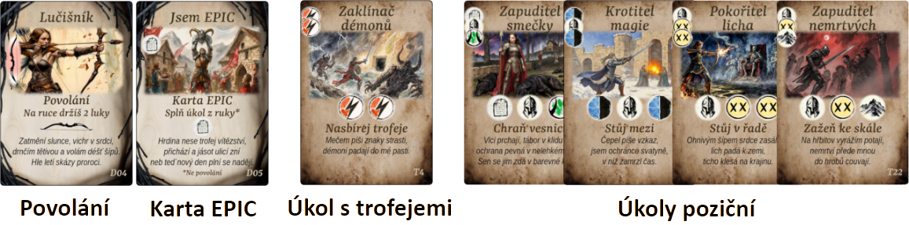

X: Musíš stát natěsno, bez mezer, bez teleportů, musíš hned sousedit.

X: Musí to být na mapě celé vodorovně nebo celé svisle, ne do zatáčky, ne po úhlopříčce.

X: Mezi vámi nikdy nesmí být hřeben hor.

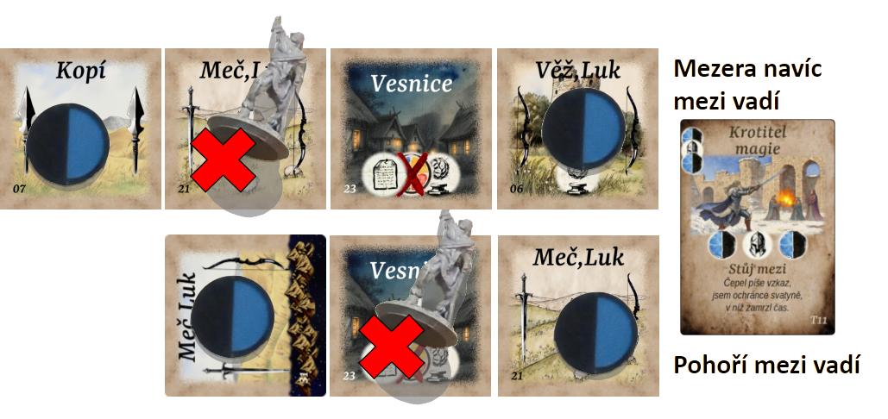

Pro úkol **"stůj mezi"** potřebuješ stát mezi vyobrazenými příšerami.

Pro úkol **"stůj v řadě"** potřebuješ, aby v řadě od tebe stály vyobrazené příšery.

Pro úkol **"chraň vesnici"** potřebuješ mít po jedné straně vesnici a po druhé vyobrazenou příšeru. Nebo stát ve vesnici, která má vedle sebe vyobrazenou příšeru.

Pro úkol **"zažeň ke skále"** je potřeba, abys stál vedle příšery a těsně za ní byla skála nebo horský hřeben.

X: Ještě jednou, ať to je naprosto jasné: Úkoly plníš až na konci kola, počítá se tvoje pozice na mapě na konci kola. To, že jsi někudy proběhl nebo tam začínal, se prostě nepočítá.

## E - Vítězství?

Jakmile dosáhneš potřebného množství slávy, vyhráváš. Žádné dohrávání kola ani podobné nesmysly. Kdo první, ten první. A kolik je potřebné množství slávy? To záleží na tom, kolik vás hraje.

H: Je to jednoduché, čím víc vás po okolí pobíhá, tím méně slávy ti stačí, aby tě už místní měli opravdu dost.

EPIC není strategická hra na celý večer. Aby byla férová, musí se hrát víckrát, třeba na dvě vítězné hry. První hru začíná ten, koho určíte. Každou další pak ten, kdo hraje hned za tím, kdo předchozí hru vyhrál. První, kdo vyhraje dvě hry, vyhrál celý turnaj.

Další možnost je hrát na trestné body. Dostaneš tolik trestných bodů, kolik ti po hře chybí bodů slávy k vítězství. A celý turnaj vyhraje ten z vás, kdo má nakonec v součtu trestných bodů nejméně.

## Kouzla

Kouzla jsou buď vázaná na zbraň, pak jsou nakreslená přímo na kartě zbraně a působí jen na tuto zbraň. Nebo jsou kouzla volná, vázaná na kouzelný artefakt, nakreslená na kartě artefaktu. Taková kouzla pak působí na zbraň, se kterou artefakt použiješ. Kouzla používáš při pohybu po mapě. Když použiješ zbraň, můžeš s ní, ale nemusíš, použít i kouzlo. Žádné kouzlo není povinné. Žádnou zbraň nejde použít s víc jak jedním kouzlem a žádné kouzlo na konkrétní zbrani nejde přenést na jinou zbraň. Kouzla mění pravidla. Pokud použiješ se zbraní kouzlo z artefaktu, jednoduše zahodíš na odkládací hromádku jak zbraň tak artefakt.

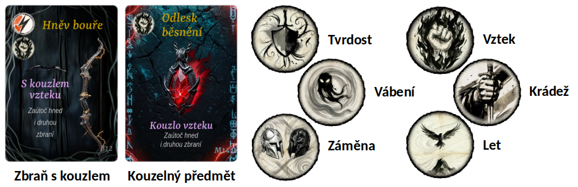

X: Ano, zbraň, která má na sobě kouzlo, můžeš použít, jako by žádné neměla.

X: Ano, i na zbraň, která má na sobě kouzlo, můžeš místo něj použít kouzlo z artefaktu. Kouzlo ze zbraně pak nemá žádný efekt.

X: Ne, nemá žádný efekt. Nikdy. Jedna zbraň, jedno kouzlo. Víc fakt ne.

X: Ano, můžeš mlátit do trávy (jít na pole bez příšery) a přitom použít zbraň a s ní kouzlo.

X: Můžeš použít víc kouzel za kolo, pokud použiješ víc zbraní. Umíš z pravidel vyčíst, kdy se to může stát?

**Kouzlo tvrdosti** říká: "Zbraň použij, ale nezahoď". Jednoduše si jí nech. Pokud bylo kouzlo napsáno na zbrani, polož zbraň před sebe na stůl, aby bylo jasné, že jsi z ní kouzlo už vyčerpal. Při příštím použití ji už budeš muset zahodit. Pokud kouzlo bylo na artefaktu, prostě zahoď artefakt a zbraň si nech.

X: Maximální počet zbraní na ruce je dvě. Nikdy víc. Ani s kouzlem tvrdosti. Prostě si kdyžtak novou zbraň dobírat nebudeš.

**Kouzlo záměny** říká: "Prohoď se s jiným hrdinou." Než zbraní zaútočíš, prohoď se na mapě s jiným hrdinou a zaútoč, jako bys stál na jeho původním poli.

X: Myslíš, že tímhle jde někoho dostat do pěkných potíží? To si piš. Prostě se prohodíte a v té díře, kde jsi byl doteď ty, je odteď on.

X: Ano, to znamená, že vedle jiného hráče musí být příšera, kterou touhle zbraní porazíš.

**Kouzlo vábení** říká: "Přilákej příšeru z jiného pole", nějakou, kterou tahle zbraň umí porazit. Tedy vezmi příšeru z políčka, kam útočíš a vyměň ji s libovolnou jinou příšerou na mapě. A zaútoč na tu novou příšeru, která teď najednou stojí vedle tebe.

X: Pokud tam nějaká stála, vyměň ji s tou, co sis vybral. Vábením nemůžeš vyrobit nové pole s dvěma příšerami.

X: Nemůžeš mečem s vábením přitáhnout démona, protože démona mečem nezapíchneš.

X: Ano, s příšerami se přesouvají i jejich body slávy.

X: Ano, jde přivábit i příšeru na původně prázdné pole.

X: Ne, nemůžeš odvábit příšeru pryč a „zapíchnout“ místo ní prázdné políčko.

X: Vábením můžeš prohodit i jednu z příšer na hradě.

**Kouzlo vzteku** říká: "Zaútoč hned i druhou zbraní". Vezmeš tedy tuto zbraň, posuneš se po mapě a zlikviduješ s ní příšeru. Pak vezmeš svou druhou zbraň, uděláš s ní další krok po mapě a zlikviduješ druhou příšeru. Musíš tu druhou zbraň samozřejmě mít.

H: Je k ničemu být zuřivý, když nemáš čím se teď ohánět.

H: Viděl jsem jednu lučišnici jak zlikvidovala démona a pak vtrhla na hrad a vymlátila to ten samý den i tam, takže tři nula.

X: Tohle kouzlo ti umožňuje použít víc zbraní za kolo, získat víc bodů slávy a posunout se dál po mapě.

X: Zbraně dobíráš až potom, co dokončíš svůj pohyb. Během jednoho tahu si tedy musíš vystačit s tím, co máš.

X: Abys mohl použít druhou zbraň, musíš nejprve použít tu první s kouzlem vzteku.

X: Druhá zbraň může mít své vlastní kouzlo, které se na tu první už nevztahuje.

X: Se zuřivostí můžeš vtrhnout po boji na hrad i z hradu po boji utéct na další pole mapy. Oboje v jednom kole ale už ne.

X: Protože nikdy nemůžeš mít více než dvě zbraně, nemá smysl v jednom kole použít zuřivost podruhé.

**Kouzlo krádeže** říká: "Zbraň si vem z ruky hrdiny". Tohle kouzlo mění, jak budeš na konci kola doplňovat chybějící zbraň. Tu jednu, na kterou se vztahuje omezení pole, můžeš místo z dobírací hromádky vzít z ruky hrdiny. Libovolný druh zbraně, od libovolného hrdiny.

H: Ano, tím myslím na jakoukoliv vzdálenost a opravdu jakoukoliv zbraň, omezení políčka ignoruj.

X: Vybíráš si kartu, nikoliv zbraň. Cílený hrdina ti ukáže pouze zadní strany karet; nemusí ti říkat, že to, co vypadá jako palice, je ve skutečnosti luk, ani jestli má na sobě kouzlo.

**Kouzlo letu** říká: "Přejdi přes hřeben hor". Tohle kouzlo mění, jak můžeš chodit po mapě. Pro tento jeden útok zbraní můžeš ignorovat případný hřeben hor v cestě.

X: Ale jen pro ten útok. Pro případné plnění úkolů tam už ten hřeben zase je.

X: Ne, velkou skálu pořád přejít nejde.

X: Samozřejmě, příšeru za těmi horami musíš umět vybranou zbraní porazit.

## Slovo závěrem

Naše hra se snaží překlenout ten most mezi hráči, kteří rádi plánují a hráči, kteří chtějí hlavně vzít palici a něco s ní EPICky praštit. Ať si užijí hru všichni a vyhraje ten nejlepší. V této hře jde hodně plánovat a bez pochyby to má na výsledek vliv. Míra náhody a chaosu je ale velká, šanci vyhrát máte všichni a nemusíte se bát žádné společnosti. A přesně tak jsme to chtěli. Tak ti hrdino přeju, ať se ti hra líbí a ať jsi dnes nejvíc EPIC právě ty.
