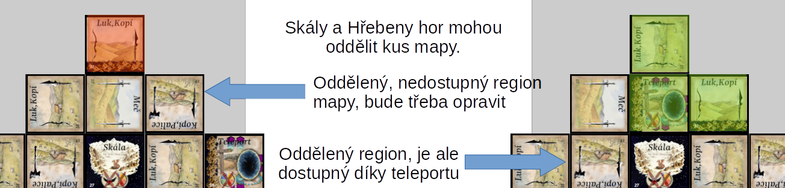
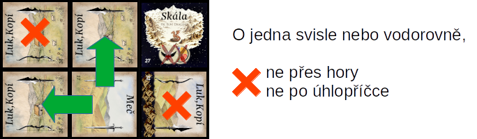
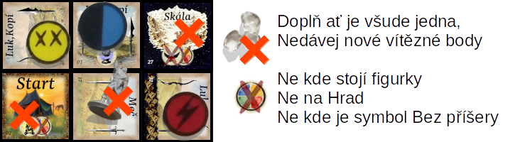
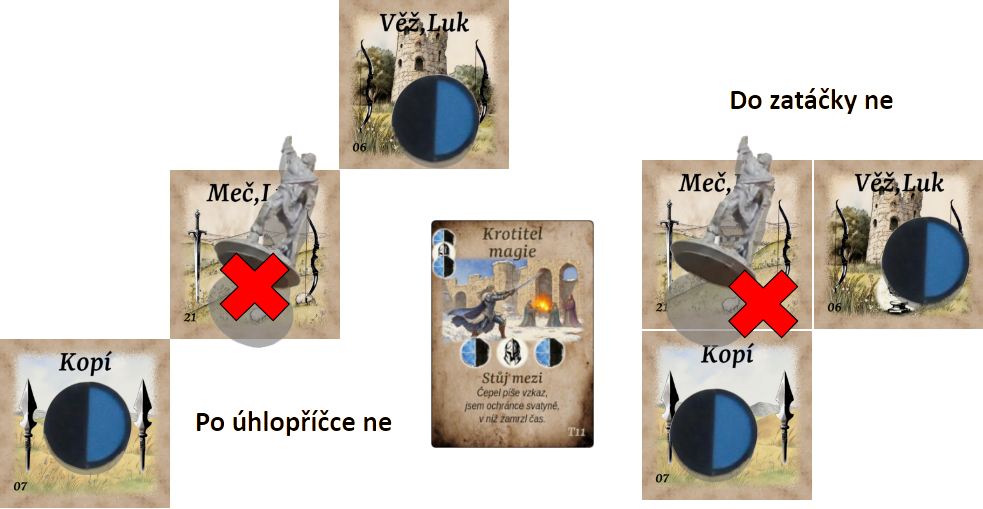
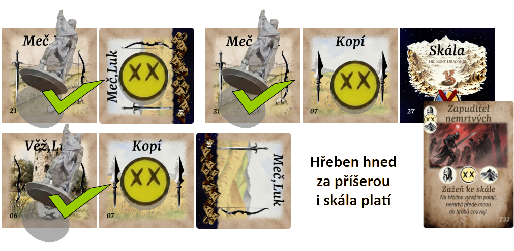
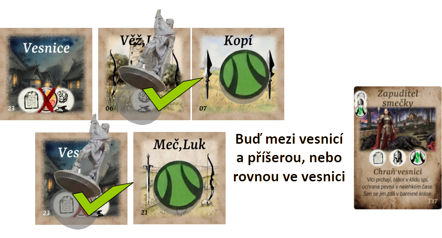

# Jen buď EPIC

2026/05

Vítej v tomto kraji, dobrodruhu. Obyvatelé jsou trápeni příšerami a proto ste přišli vy. Boj s příšerami je vaše řemeslo. A jste v něm EPICky dobří. Síň slávy však čeká jen na nejrychlejšího z vás.

## Princip hry

Jen buď EPIC je kompetitivní hra pro 2 - 4 hráče. Střídáte se v tazích. Karty kouzelných předmětů a legendárních zbraní se vám míhají na ruce jedna za druhou. Posouváte své figurky po mapě a čistíte krajinu od příšer. Tahy jsou rychlé, ale promyšlené. Bojem a plněním úkolů si dobýváte slávu a kdo v tom bude nejrychlejší, vyhraje.

## Herní prvky

**Mapa** je rozložená uprostřed stolu. Na ní stojí vaše figurky a leží žetony příšer a vítězných bodů. Vše, co je na mapě, kde kdo stojí a jaké příšery kde jsou, je veřejné.

**Dobírací balíčky** karet leží vedle mapy. Je tu lícem dolů šest dobíracích balíčků. Zbraně: kopí, palice, meče a luky, a dále: úkoly a předměty. Dál je tu lícem nahoru veřejná nabídka úkolů a odkládací balíček zahraných karet.

**(Každý hráč) Na ruce** držíte karty zbraní, předmětů a úkolů. Všechny jsou tajné, neukazujte je, pokud to pravidla výslovně nenařídí. Na ruce máte navíc dvě **karty příběhu**. Jedna se jmenuje Povolání a druhá Jsem EPIC.

 

**(Každý hráč) Na stole** před sebou máte každý svou hromádku získaných vítězných bodů a karet splněných úkolů. A žetony poražených příšer - trofeje.

**Zbylé žetony** příšer čekají v losovacím váčku.

## Příšery a zbraně
Kulaté žetony na mapě představují příšery. Ve hře jsou čtyři barvy žetonů, odpovídající čtyřem druhům příšer. S příšerami se bojuje kartami zbraní. Každá zbraň ve hře je určená k poražení konkrétního druhu příšery. Co na koho platí, si nemusíte pamatovat. Je to napsané na rubu dobíracích balíčků zbraní. Pátou zbraní ve hře jsou bomby. Ty působí na všechny příšery bez rozdílu. Pro poražení příšery stačí mít na ruce správnou zbraň. Kartu zbraně zahodíte a příšera je poražená.

**Zvíře** je dravec, který svou nebezpečností překročil hranici toho, co místní sami umí zvládnout. Například obří lidožravý medvěd, nebo třeba početná smečka hladových vlků. Ve hře jsou to **zelené žetony s rohy** a platí na ně kopí.

**Nemrtvý** je souhrnný název pro mrtvolu oživenou kouzlem či prokletím. Například zombie, duch nebo kostlivec. Zde jsou to **žluté žetony s křížky místo očí** a platí na ně palice.

**Člověkem** se míní pověstná banda mordýřů, nebo třeba rozezlený čaroděj. Lidé jsou vždy někde mezi dobrem a zlem, proto mají **modrý napůl plný žeton**, a platí na ně meč.

**Démon** je bytost, která prošla bránou z jiného světa. Vesničané říkají, že démoni přišli z pekla. Ale vy víte, že míst, odkud přicházejí démoni, je mnoho. **Žeton je červený, rozetlý bleskem**, a platí na ně luk.

X: I na líci každé dobrané zbraně vidíš, na kterou příšeru platí. Podle symbolu v levém horním rohu karty.

X: Bomba má svůj vlastní symbol, aby se na její kartu nemusely vypisovat všechny 4 symboly příšer. 

X: Pozor, zbraně jsou v každém balíčku namíchané. Čtvrtina zbraní v každém balíčku neodpovídá rubu. Při dobrání zbraně z balíčku luků (co má na rubu luk) máš šanci 1:3 že táhneš palici, kopí, nebo meč.

## Příprava hry

Vezměte karty nápověd a dejte je na dobře dosažitelné místo. Obsahují shrnutí nejdůležitějších pravidel hry, abyste si hlavní pravidla jednodušeji osvojili. Jsou rozděleny podle kapitol, kterých se týkají.

Vyberte začínajícího hráče, bude hrát první. Bude mít oproti ostatním malou výhodu, proto vyberte někoho méně zkušeného. Hrajte po směru hodinových ručiček, takže hráč napravo od začínajícího bude hrát poslední. Jako kompenzaci bude velet stavbě mapy. Tady je pár možných tvarů mapy, jeden si vyberte.

Velitel mapy vezme 5 speciálních polí (hrad, dvě skály a dva starty) a odloží je stranou. Zbytek polí zamíchá. Speciální pole rozloží podle obrázku mapy. Z ostatních polí postaví vybraný tvar. Pole pokládá lícem nahoru a při pokládání každé pole náhodně otočí. Po sestavení mapy mu jedno pole přebyde. Vrátí ho do krabice, nebude v této hře potřeba. Pak se velitel podívá, jak jsou umístěné hory, a zkontroluje, zda není nějaké pole zcela nedostupné. Chodí se vodorovně a svisle, a přes hory chodit nejde. Pokud se na nějaké pole nedá dojít od startu nebo teleportu, je třeba to opravit. Velitel mapy vybere, které pole se v takovém případě pootočí. Nakonec přidá miniatury skal a hor.

X: Mapa má působit náhodně. Pokud bys orientaci polí mapy srovnával, aby byly otočené všechny stejně, hře to ublíží.

X: Hru připravujete všichni společně, ale při stavbě mapy rozhoduje velitel mapy.

X: Po mapě chodíš vodorovně a svisle a nikdy ne přes skály a hory. Vycházíš ze startu či od teleportu. Zkontroluj, zda jde na každé pole dojít. Pokud ne, oprav to tím, že nějaké otočíš.

Tahejte z váčku náhodně příšery. Na každé pole vylosujte jednu. Výjimkou je hrad, kde jsou příšery dvě. Příšery se neumísťují na pole start, skála, vesnice a teleport (pole mají symbol "Bez příšery"). Na každou příšeru položte vítězný bod.

Zbylé příšery vraťte do váčku, budou při hře potřeba. Zbylé vítězné body vraťte do krabice, už potřeba nebudou. Připravte a zamíchejte všech šest dobíracích balíčků karet: kopí, palice, meče, luky, předměty a úkoly.

Každý si doberte své dvě karty příběhu. Kartu "Jsem EPIC" máte každý stejnou. Kartu povolání si vylosujte. Od začínajícího hráče si každý vybere svou figurku a zvolte, na kterém ze startů chcete začínat.

X: Volba figurky je jen estetická, hru neovlivní.

X: Můžete klidně začít všichni na stejném startu.

X: Když vybíráš, kde budeš začínat, ještě nevíš, jaké jsou úkoly. Znáš pouze kartu povolání. Úkoly budou překvapení pro všechny. 

**!!!** Pozor, teď budete vybírat počáteční zbraně. Špatný výběr vám může ztížit začátek hry. Přečtěte si nejdřív, jak se zbraně používají, viz "Tah hráče" a pak teprve dokončete přípravu.

Každý si doberte jednu kartu úkolu a jednu kartu předmětu. Dále si doberte dvě zbraně. Berte si je postupně, od začínajícího hráče. Můžete brát z jakých balíčků zbraní chcete, klidně každou z jiného.

H: Cesta za slávou je trnitá. Doufám, že už teď víš, že luk na kostlivce nestačí.

X: Často se vyplatí vzít si druhou zbraň, až když víš, jakou zbraň sis dobral jako tu první.

Z dobíracího balíčku úkolů otočte tři vrchní karty. Vyložte je jako veřejnou nabídku. Tím je hra připravená začít.

## Tah hráče

Tah se skládá z posouvání figurky po mapě a hraní karet z ruky. Na ruce máte vždy nanejvýš dvě zbraně, dvě karty příběhu co jste dostali na začátku hry, a libovolné množství karet úkolů a předmětů. Hrajte postupně. Vždy hraje jeden hráč a ostatní mu do jeho tahu nezasahují. Což ale neznamená, že mu do toho nemohou mluvit. V dalších kapitolách je tah rozepsán podrobněji, ale teď shrňme to nejdůležitější.

**1A) Pohyb** Posouváte svou figurku o jedno pole vodorovně nebo svisle. Nikdy ne přes hory. Podle karet zbraní, které držíte v ruce, a příšer na sousedních polích, vyberte, kam půjdete. Můžete jít i na pole bez příšery, pokud je to pro vás výhodné. Ať už na cílovém poli příšera je či není, při pohybu zahodíte zbraň. Pokud nikam jít nechcete nebo nemůžete, čeká vás **1B) Odpočinek**. Ať už se pohybujete nebo odpočíváte, vždy děláte i ostatní části tahu 2 - 5.

H: Jde o vítězné body. A ty jsou za boj s příšerami. Ideálně si tedy vyber příšeru, která má u sebe vítězný bod.

Zbraň odhoďte. Posuňte svou figurku na dobyté pole. Vezměte si poraženou příšeru jako trofej a její vítězný bod si položte před sebe.

H: Držíš palici a vedle sebe vidíš nemrtvého (žlutý žeton, na ně jsou palice určené). Tak zahodíš palici, přesuneš se na jeho pole a vezmeš si vítězný bod a žeton příšery jako trofej.

**2) Vybavení**. Přišli jste do vesnice nebo do věže? V takovém případě si nabíráte karty úkolů a předmětů (vždy po jedné kartě předmětu a úkoly jen ve vesnici). Těchto karet můžete mít na ruce, narozdíl od zbraní, kolik chcete.

**3) Dobrání karet zbraní**. Dobíráte vždy do dvou zbraní na ruce. Vyberte si zbraň podle toho, co je nakreslené na poli mapy, na které jste vstoupili. Doberte si kartu z příslušného balíčku. Pokud dobíráte i druhou zbraň, tu si vyberte libovolnou.

**4) Plnění úkolů**. Po dobrání zbraní jsou na řadě úkoly. Pokud splňujete podmínky některého z úkolů (například máte potřebné trofeje), můžete si ho teď vyložit před sebe, a mít ho odteď splněný. Každý splněný úkol má cenu jednoho vítězného bodu. Pokud se uvolnilo místo ve veřejné nabídce úkolů, doplňte ji nakonec opět na tři karty.

**5) Vítězství**. Tím tah jednoho hráče končí. Zkontrolujte, kolik máte vítězných bodů a splněných úkolů (a karet příběhu). Jejich součet je vaše skóre. Pokud jste ještě nedosáhli vítězného množství (pro 2/3/4 hráče 12/10/9 bodů), pokračuje hra tahem dalšího hráče.

## Tah 1A) Pohyb

Základem tahu je posunutí figurky po mapě. S figurkou táhněte o jedno pole vodorovně nebo svisle. Nemůžete táhnout přes hory, to je nepřekonatelná překážka. Ostatní figurky hrdinů vám nepřekáží, na poli vás může stát víc. Při každém pohybu musíte zahodit zbraň, i když vstupujete na pole bez příšery. Pokud na poli příšera je, musí být zbraň taková, aby příšeru porazila, viz "Příšery a zbraně".

H: Naběhl jsi tam a mlátil tou palicí kolem sebe, až se rozbila. Nikdo tam nebyl, tak tomu říkejme trénink, ano?

X: Hory nepřekáží, pokud máš kouzlo létání, viz "Kouzla". Zato skála, ta překáží vždy.

X: Zbraň zahazuješ, i když jdeš na pole, kde žádná příšera není nebo třeba do vesnice.

X: Ostatní hrdinové tě v pohybu nijak neomezují. Klidně s nimi můžeš být na stejném poli.

**Pole start** je místo, kde máte svůj stan. Příšery se na toto místo bojí. Když se umisťují příšery tak je na start nedávejte.

X: Na každé pole, kde můžeš stát, tedy i sem, můžeš přivolat příšeru kouzlem vábení.

**Pole vesnice** je pár usedlostí a hostinec. Příšery se do vesnice neumisťují, ale hráči tu jsou vítaní. Je tu řada krámů, které můžete navštívit, viz "Tah 2) Vybavení".

**Pole věž** má ukrytou truhlu s kouzelným předmětem. Příšera tu sice je, ale když se jí zbavíte, můžete truhlu prozkoumat, viz "Tah 2) Vybavení".

**Pole teleport** je výjimečné. Na něm nemůžete nikdy stát a nikdy na něm není příšera. Ale když stojíte vedle teleportu, můžete jedním krokem projít teleportem, na libovolné pole, sousedící se kterýmkoliv teleportem na mapě. Jako by ta pole byla hned vedle sebe. Na teleport (a ani z něj) stále nesmíte jít přes hory.

X: I hory na poli teleport jde přeletět kouzlem létání.

X: Projít teleportem je jako normální krok na sousední pole mapy. Odevzdáváš jednu zbraň podle příšery na poli, kam jdeš.

X: Nemůžeš vstoupit do teleportu a vystoupit na stejné pole, odkud si vyšel. Musíš z teleportu vystoupit na jakékoli jiné pole.

H: Skoro to vypadá, jako by tvým největším nepřítelem byly hory. S tím, co vše do boje táhneš, se vlastně není čemu divit.

**Pole skála** je také výjimečné. Přes něj se prostě chodit nijak nedá. Ani příšery se sem neodváží.

H: Tady někde žije hodně velký drak. Tak velký že se ho i ty bojíš.

X: Opravdu přes skálu jít nemůžeš. Ani s kouzlem létání.

**Pole hrad** se tyčí nad okolní krajinou. Prastará zřícenina, na které spolu straší hned dvě příšery. Zlikvidujte je a čekají vás dva vítězné body. Ale potřebujete porazit obě příšery naráz. Nejde porazit jen jednu. Musíte je porazit obě zároveň. Přesto stále jednou zbraní porazíte jen jednu příšeru. Zde ale můžete k boji použít naráz obě zbraně, které máte.

X: To znamená, že na hrad můžeš pouze, pokud máš zbraně na poražení obou příšer, které tam jsou. Na každou zbraň smíš použít kouzlo, ale není to povinné. Na tomto poli jsou příšery tak blízko u sebe, že budeš bojovat s oběma zároveň, i kdybys žádné kouzlo nepoužil.

X: Je běžné dvakrát použít jednu zbraň s kouzlem tvrdosti, nebo dvě různé zbraně.

X: Z hradu ti někdo mohl, kouzlem vábení, jednu příšeru ukrást. Během hry tedy nemusí platit, že na hradě jsou před jeho dobytím vždy dvě příšery.

## Tah 1B) Odpočinek

Pokud se nemůžete nebo nechcete pohnout po mapě, **odpočíváte**. Nejprve zahoďte z ruky všechny své zbývající zbraně.

Když odpočíváte vy, odpočívají i příšery. Doplňte na všechna volná pole mapy novou, náhodně vylosovanou příšeru z váčku. Nedoplňujte je na hrad, start, vesnici, teleport nebo skálu, a také vynechte místa, kde stojí figurky hrdinů. Losování provádí odpočívající hrdina, ale může tu práci delegovat, pokud je někdo ochotný mu pomoci. Na nové příšery už nedávejte vítězné body.

Když odpočíváte, máte čas si přečíst poštu a dozvědět se novinky. Teď si tedy můžete vyměnit jeden úkol z ruky za nový. Musíte k tomu nějaký na ruce mít a nejprve ho zahodit. Pak si teprve doberte nový, z dobíracího balíčku úkolů.

Když je vše připraveno, vyberte si, kde chcete odpočívat a ihned se tam přesuňte. Buď zůstaňte tam, kde jste byli, nebo se přesuňte na libovolné pole start.

X: I když odpočíváš, hraješ ostatní fáze tahu. Například tedy můžeš doplnit vybavení, pokud budeš odpočívat ve vesnici nebo u věže.

X: Přestože odpočíváš, můžeš plnit úkoly. I ty co jsi teď nově získal na ruku.

H: Dobrý důvod k odpočinku je například to, když ti jiní ukradnou i poslední zbraň.

X: Odpočívat můžeš i dobrovolně.

H: Nové příšery jsou nové, žádná sláva za ně nebude. Proto nemají vítězný bod.

H: Na hradě už jsi to vymlátil, teď se tam příšery bojí.

X: Nikdy nedávej nové příšery na hrad, start, vesnici, skálu nebo teleport. Kromě hradu je na nich nakreslená ikonka "Bez příšery".

X: Nikdy nedávej novou příšeru na pole, kde stojí nějaká figurka. Nedávej jí ani na pole, kde před odpočinkem stála figurka, co si šla odpočinout.

## Tah 2) Vybavení (vesnice či věž)

Ve věži a ve vesnici můžete získat novou kartu předmětu, ve vesnici navíc i kartu úkolu. Stačí, abyste tento tah přišli, prošli nebo odpočívali na tomto poli.

X: Pokud odpočíváš, nakoupit můžeš. Pokud jsi jen prošel s kouzlem vzteku, nakoupit můžeš.

X: Pokud jsi tam byl jen na začátku tahu a jen jsi tento tah odešel pryč, tak nakoupit nestihneš.

X: Vybavení řešíš před dobíráním zbraní, ale až po skončení pohybu. Znamená to, že v tahu, kdy si nový předmět dobereš, ho určitě nestíháš i použít. Zato nový úkol hned i splnit můžeš.

H: V noci mě někdo teleportoval do vesnice. Tak sem se ráno nezdržoval. Seberal svůj ranec a utekl. Dříve než krámy otevřely.

H: Znal jsem jednoho lovce. Přišel do vesnice a trvalo mu tři dny, než se probral nabídkou místního obchodu.

**Ve věži i ve vesnici** si doberte novou kartu předmětu.

**Ve vesnici** navíc proberte vývěsku s úkoly.
- Jednu kartu z vyložené nabídky úkolů, nebo horní z dobíracího balíčku, si vezměte na ruku jako svůj další úkol.
- Navíc jednu kartu z vyložené nabídky úkolů můžete, ale nemusíte, zahodit na odhazovací balíček.

H: Za poflakování po hospodách sláva není, jsi hrdina, ne bard. Ale dají se tu doplnit zásoby.

H: A hele, tady píšou "Hledá se hrdina". Tenhle letáček ostatní vidět nemusí. Vezmu si ho, děkuji.

X: Z veřejné nabídky tedy můžeš ve vesnici odstranit až dvě karty úkolů. Nabídka se znovu doplní před tahem příštího hráče.

X: Na počet předmětů ani karet úkolů v ruce není žádný limit. Můžeš jich mít, kolik chceš.

X: Máš často ve vesnici nutkání nabídku úkolů hned doplňovat? Klidně, ale doplň je lícem dolů, a nech až příštího hráče, ať si je před svým tahem otočí.

H: Je až zvláštní, jak z vývěsních cedulí rychle mizí ty snadnější úkoly. Ale že by někdo sundal ten nesplnitelný úkol "Ulovte draka", to ne.

## Tah 3) Dobrání karet zbraní

Teď si doberte nové zbraně tak, abyste měli na ruce, opět dvě. První zbraň berte z balíčku podle pravidel vašeho pole mapy. Ze kterých balíčků můžete vybírat, je nakresleno přímo na poli, kde stojíte. Pokud vám chybí i druhá zbraň, doberte si ji z libovolného balíčku bez omezení.

X: Pokud ti nechybí žádná zbraň, máš pořád ještě dvě, nedobírej si žádnou.

X: Pokud některý dobírací balíček došel, tak už hraješ opravdu nečekaně dlouho. Nezbývá ti, než roztřídit odhazovací balíček a dobírací balíčky obnovit.

Pokud jste na poli start, hrad nebo vesnice, tak tam žádné omezení na dobrání první zbraně není.

X: S kouzlem krádeže, viz kapitola "Kouzla", můžeš ukrást zbraň z ruky libovolného hráče. Pokud si dobíráš dvě zbraně, tak krádež nahrazuje dobrání první zbraně. Té zbraně, jejíž výběr by podléhal omezení podle pole mapy.

Po dobrání zbraní musíte také zahodit nadbytečné trofeje: žetony poražených příšer. Můžete si nechat maximálně tři. Zvažte, které se vám ještě budou hodit k plnění úkolů a které už ne, viz "Tah 4) Plnění úkolů".

H: Nikdo s sebou netahá všechno a nikoho nezajímá, co jsi zapíchl před půl rokem.

## Tah 4) Plnění úkolů

Teď, když máte akci za sebou, podívejte se na nabízené úkoly a vyhodnoťte, zda jste nějaké splnili. Najednou můžete splnit libovolný počet úkolů. Můžete vybírat z veřejné nabídky, ze svých úkolů na ruce a svých karet příběhu. Každý splněný úkol či příběh vyložte před sebe. Každý má stejnou hodnotu jako vítězný bod.

Po vyložení splněných karet doplňte z dobíracího balíčku veřejnou nabídku úkolů pro dalšího hráče tak, aby tam opět byly tři. Úkoly jsou typu **Trofej**, **Formace**, nebo **Bariéra**. Pokud jsou po doplnění všechny karty ve veřejné nabídce stejného typu, zahoďte je a doplňte nové tři.

X: Když po splnění úkolů, doplňuješ veřejnou nabídku, pro dalšího hráče, už tvůj tah skončil. Ty nově otočené úkoly už tvé nejsou, splnit je už nemůžeš.

X: Doplňují se jen úkoly ve veřejné nabídce. Úkoly na ruce se získávají ve vesnici, nebo při odpočinku.

X: Úkoly doplňuj lícem dolů a otoč je až na začátku tahu nového hráče, předejdeš tím zmatku.

Kartu příběhu **Povolání** splníte, pokud po dobrání zbraní držíte v ruce právě ty zbraně, které jsou na kartě povolání napsané.

H: Palice, to je panečku zbraň. Sním, že budu slavným bijcem. Škoda, že v okolí jsou samí loupežníci a palice by mi tu byla k ničemu.

X: Kartu povolání máš po celou hru jen tu, kterou jsi dostal na začátku. Buď se ti jí splnit podaří, nebo ne. Jinou mít celou hru nebudeš.

Kartu příběhu **Jsem EPIC** vyložte současně s první kartou úkolu, kterou vykládáte z ruky.

X: Tuto kartu máš jen jednu, tu co jsi dostal na začátku hry.

X: Díky ní tedy dostaneš druhý vítězný bod za první splněný úkol z ruky. Může to být i úkol, který jsi získal ve vesnici v tomto tahu.

X: Jsem EPIC se nevykládá s kartou povolání, pouze s kartou úkolu.

Úkoly typu **Trofej** mají na sobě pouze symboly příšer v různých kombinacích. Úkol splníte, když u sebe máte zobrazené trofeje. Buď dvě stejné trofeje, nebo tři různé, podle druhu úkolu. Pro splnění úkolu stačí trofeje mít, neodevzdávají se.

X: Nikdy nemůžeš splnit v jednom tahu víc než jeden úkol typu Trofej.

X: Pro splnění úkolu "dvě trofeje zvířat" můžeš mít i jakoukoli třetí trofej, to ničemu nevadí.

Úkoly typu **Formace** a **Bariéra** mají na sobě kromě symbolu příšery i symbol hrdiny, případně symbol vesnice nebo hor. Abyste je splnili, musíte stát na mapě ve vodorovném či svislém směru, jak je na úkolu znázorněno.

X: Musíš stát natěsno, bez mezer, musíš hned sousedit.

X: Pokud je potřebná příšera na druhé straně teleportu, pro splnění úkolu to nestačí. Teleporty jsou pro plnění úkolů vždy překážkou. 

X: Musí to být na mapě celé vodorovně nebo celé svisle. Nesmí to být do zatáčky, nebo po úhlopříčce.

X: Mezi vámi nikdy nesmí být hory. 

Pro úkol **"stůj mezi"** (typ úkolu **Formace**) potřebujete stát mezi vyobrazenými příšerami.

Pro úkol **"stůj v řadě"** (typ úkolu **Formace**) potřebujete, aby v řadě od vás stály vyobrazené příšery.

Pro úkol **"chraň vesnici"** (typ úkolu **Bariéra**) potřebujete mít po jedné straně vesnici a po druhé vyobrazenou příšeru. Nebo stát ve vesnici, která má vedle sebe vyobrazenou příšeru. Věž nestačí, opravdu to musí být vesnice.

Pro úkol **"zažeň ke skále"** (typ úkolu **Bariéra**) je potřeba, abyste stáli vedle příšery a těsně za ní byla skála nebo hory.

X: Pozor! Úkoly plníš až na konci tahu, počítá se tvoje pozice na mapě na konci tahu. Že jsi někudy proběhl, nebo tam byl na začátku tahu, pro splnění úkolu nestačí.

## Tah 5) Vítězství

Vyhraje ten z vás, kdo se první stane opravdu slavným. Vaše skóre je součet splněných úkolů (a karet příběhu) a nasbíraných vítězných bodů. Jakmile dosáhnete potřebného množství, vyhráváte. Ihned. Potřebné skóre záleží na počtu hráčů.

H: Se slávou to je jednoduché. Čím více nás po okolí pobíhá, tím méně slávy stačí jednomu, aby nás místní už měli opravdu dost.

## Kouzla

Magie je chaos. Kouzla mění pravidla. Kdo je ovládne, může ovládnout celou hru. Je dobré jim pořádně porozumět.

Kouzla jsou buď vázaná na zbraň, nebo volná. Vázaná kouzla jsou nakreslená přímo na kartě zbraně a působí jen na tuto zbraň. Volná kouzla jsou nakreslená na kartě předmětu. Taková kouzla pak působí na zbraň, se kterou předmět použijete. Kouzla používáte při pohybu po mapě. Uděláte krok po mapě, použijete zbraň a s ní můžete použít kouzlo. Žádné kouzlo není povinné. Každou zbraň jde použít, jako by kouzlo neměla. Naopak, žádnou zbraň nejde použít s více než jedním kouzlem. Žádné kouzlo vázané na zbrani nejde přenést na jinou zbraň. Pokud použijete se zbraní kouzlo z předmětu, jednoduše odhodíte jak zbraň, tak předmět na odkládací balíček.

X: Zbraň, která má na sobě kouzlo, můžeš použít, jako by žádné neměla.

X: I na zbraň, která má na sobě kouzlo, můžeš místo něj použít kouzlo z předmětu. Kouzlo ze zbraně pak nemá žádný efekt.

X: Ne, dvě kouzla najednou nikdy nemůžeš použít! Jedna zbraň, jedno kouzlo. Víc prostě ne.

X: Můžeš klidně mlátit slámu (jít na pole bez příšery) a přitom použít zbraň s kouzlem.

X: Můžeš použít víc kouzel za tah, pouze pokud tento tah použiješ víc zbraní. Například při dobývání hradu. Pořád ale hlídáš, které kouzlo je použité se kterou zbraní.

**Kouzlo tvrdosti** říká: "Po prvním použití zbraň nezahazuj". Jednoduše si ji nechte. Pokud bylo kouzlo napsáno na zbrani, pamatujte si, že z ní už kouzlo bylo vyčerpáno. Při příštím použití ji už budete muset zahodit. Pokud bylo kouzlo na předmětu, prostě zahoďte předmět a zbraň si nechte.

X: Zbraň s vyčerpaným kouzlem tvrdosti si můžeš v ruce otočit. Má k tomu v pravém dolním rohu symbol **"vyčerpané kouzlo"**.

X: Maximálně můžeš držet v ruce dvě zbraně. Nikdy víc. Ani s kouzlem tvrdosti. Novou zbraň si pak prostě nedobíráš.

X: Pokud ti někdo zbraň s vyčerpaným kouzlem sebere, kouzlo s novým majitelem zase nabere sílu a bude možné jej použít znovu.

**Kouzlo záměny** říká: "Před útokem se prohoď s jiným hrdinou." Než zbraní zaútočíte, prohoďte si místo na mapě s jiným hráčem a zaútočte, jako byste stáli na jeho původním poli.

X: Odteď ty stojíš tam kde stál on a on je tam co jsi byl ty. Také si myslíš, že tím jde někoho dostat do pěkných potíží?

X: Pozor, nejdřív se prohazujete a až pak zaútočíš na příšeru. Nikdy ne naopak.

X: To znamená, že vedle jiného hráče musí být pole, na které s touto zbraní můžeš jít.

**Kouzlo vábení** říká: "Přilákej příšeru z jiného pole". Vyberte libovolnou příšeru na mapě, kterou jde zvolenou zbraní porazit. Dejte jí na pole kam teď zaútočíte. Pokud tam už nějaká příšera je, tak je vyměňte.

X: Pokud tam nějaká stála, vyměň ji s tou, co sis vybral. Vábením nemůžeš vytvořit nové pole se dvěmi příšerami.

X: Přivábená příšera musí odpovídat zbrani, na které toto kouzlo je. Nemůžeš mečem s kouzlem vábení přilákat démona, protože démona mečem nezapíchneš.

X: S příšerami se přesouvají i jejich body slávy.

X: Jde přivábit příšeru i na pole co má být prázdné, jako je start nebo vesnice. Stejně jí hned zlikviduješ.

H: Dokonce, i když tam stojí jiný hrdina. Aspoň uvidí, jak se tahle práce dělá.

X: Příšeru musíš přivábit. Nemůžeš jí jen odvábit pryč a „zapíchnout“ místo ní prázdné pole.

X: Vábením můžeš prohodit, nebo odlákat, i příšeru z hradu.

X: Také nejde kopím s vábením na hradě zapíchnout zvíře a pak místo druhé příšery přivábit něco, co umíš porazit svou druhou zbraní. Vždy vábíš příšeru, kterou porazíš tou zbraní, na které je kouzlo vábení. Tedy kopím můžeš přivábit pouze zvíře.

**Kouzlo vzteku** říká: "Zaútoč hned i druhou zbraní". Vezmete tedy tuto zbraň, posunete se po mapě a zlikvidujete s ní příšeru. Pak vezmete svou druhou zbraň, uděláte s ní další krok po mapě a zlikvidujete druhou příšeru. Druhou zbraň musíte samozřejmě mít.

X: I na prázdné pole můžeš zaútočit zuřivě a hned běžet dál.

H: Je k ničemu být zuřivý, když nemáš další zbraň k boji.

H: Viděl jsem jednu lučišnici, jak zlikvidovala démona a pak vtrhla na hrad a vymlátila to ten samý den i tam, takže tři nula pro hrdiny.

X: Tohle kouzlo ti umožňuje použít víc zbraní za tah, získat víc bodů slávy a posunout se dále po mapě.

X: Zbraně a předměty dobíráš až potom, co dokončíš svůj celý pohyb. Během jednoho tahu si tedy musíš vystačit s tím, co máš na začátku tahu.

X: Abys mohl použít druhou zbraň, musíš nejprve použít tu první s kouzlem vzteku.

X: Druhá zbraň může mít své vlastní kouzlo, které se na tu první už nevztahuje.

X: Se zuřivostí můžeš po boji vtrhnout na hrad, nebo z hradu po boji utéct na další pole mapy. Ale obojí v jednom tahu už ne.

X: Protože nikdy nemůžeš mít více než dvě zbraně, nemá smysl v jednom tahu použít zuřivost podruhé.

X: Když díky zuřivosti proběhneš vesnicí nebo věží, dobereš si novou kartu předmětu. Dobíráš si ji ale až potom, co tvůj pohyb skončil. Tento tah ho tedy ještě nesmíš použít. 

**Kouzlo krádeže** říká: "Novou zbraň si pak vem z ruky hráče". Toto kouzlo mění způsob, jak budete po pohybu doplňovat chybějící zbraň. Tu jednu, na kterou se vztahuje omezení pole, můžete místo z dobíracího balíčku vzít z ruky jiného hráče. Můžete vzít jakýkoliv druh zbraně od jakéhokoliv hráče.

H: Tím myslím na jakoukoli vzdálenost a opravdu jakoukoli zbraň.

X: To je ta tvá první dobíraná zbraň tahu. Kdyby sis náhodou měl dobrat i druhou zbraň, ber si ji už vždy z libovolného balíčku.

X: Vybíráš si kartu, nikoliv zbraň. Cílený hráč ti ukáže pouze zadní strany karet. Nemusí ti říkat, že to, co vypadá jako palice, je ve skutečnosti luk, ani jestli má karta kouzlo či ne.

**Kouzlo létání** říká: "Zaútoč přechodem přes hory". Tohle kouzlo mění způsob, jak můžete chodit po mapě. Při tomto jednom útoku zbraní můžete ignorovat případné hory v cestě.

X: Ale jen pro tento útok. Pro plnění úkolů tam už ty hory opět jsou.

X: Pole skála pořád přejít nejde. Je na něm pro jistotu nakreslený i symbol "Bez létání".

X: Samozřejmě, příšeru za těmi horami musíš vybranou zbraní porazit. Nebo letět někam, kde žádná příšera není.

H: Epické je jednou očarovanou zbraní, jedním krokem, k poražení jedné příšery, přeletět dvoje hory.

## Jak hrát víc her

EPIC není strategická hra na celý večer. Je celkem hodně náhodná a měla by se hrát víckrát za sebou.

**Můžete hrát opakovaně**, například na dvě vítězné hry. První hru začíná ten, koho určíte. Každou další hru pak zahajuje ten, kdo hraje hned po hráči, který předchozí hru vyhrál. Prostě tak, aby ten, kdo minulou hru vyhrál, hrál novou hru jako poslední. První, kdo vyhraje dvě hry, vítězí v celém turnaji.

**Můžete hrát na trestné body**. Dostanete tolik trestných bodů, kolik vám po hře chybí k vítězství. A celý turnaj vyhraje ten z vás, kdo má nakonec v součtu trestných bodů nejméně.

**Můžete dohrávat** poslední kolo. Když první z vás získá body potřebné k vítězství, dohrajete až k začínajícímu hráči. Pokud má nakonec víc hráčů nejvíc vítězných bodů, vyhraje ten, kdo má víc splněných úkolů.

H: Všiml sis, že jména splněných úkolů dělají titul, kterým ti místní budou odteď říkat?

H: Dohrávání není v duchu této hry, ale jde to. Není to na škodu. A někteří to opravdu mají radši. Tak prosím, tady to máš, jako volitelné pravidlo.

## Slovo závěrem

Naše hra se snaží překlenout ten most mezi hráči, kteří rádi plánují a hráči, kteří chtějí hlavně vzít palici a něco s ní EPICky praštit. Hru jsme vyvíjeli, připravovali a testovali dva roky. Byla to skvělá jízda a ohromné množství legrace. Tak vám přejeme, ať baví i vás.

V této hře jde hodně plánovat a bez pochyby to má vliv na výsledek. Míra náhody a chaosu je však tak velká, že šanci vyhrát máte všichni. A přesně tak jsme to chtěli. Tak ti, hrdino, přeju, ať se ti hra líbí a ať jsi dnes nejvíc EPIC právě ty.

H: Copak v tom balíčku luků není jedinej luk?!

H: Když budu vábit příšery rovnou do vesnice, určitě budu brzy velmi slavná.

H: Nechali jste mi jen jedinou zbraň lumpové, ale já ten hrad stejně dobiju. Ona je to totiž tvrdá bomba!

H: Neuvěříte, co jsem dneska viděl. Proběhla tudy barbarská válečnice. Šel jí kouř z uší a rozbila si meč o výlohu v obchodě s kouzelnými předměty. Asi jí to nestačilo, tak se chopila obrovského kladiva a s křikem běžela dál, kamsi za humna.
