# Jen buď EPIC

2026/03

Kompetitivní hra o boji s příšerami pro 2 - 4 hráče.

Krajem se potulují příšery, a tak jste přišli. Boj s příšerami je vaše řemeslo. A jste v něm EPICky dobří. Síň slávy však čeká jen na nejrychlejšího z vás.

## Myšlenka hry

Střídáte se v tazích. Karty kouzelných předmětů a legendárních zbraní se vám míhají na ruce jedna za druhou. Posouváte své figurky po mapě a čistíte krajinu od příšer. Tahy jsou rychlé, ale promyšlené. Bojem a plněním úkolů si dobýváte slávu a kdo v tom bude nejrychlejší, vyhraje.

## Herní prvky

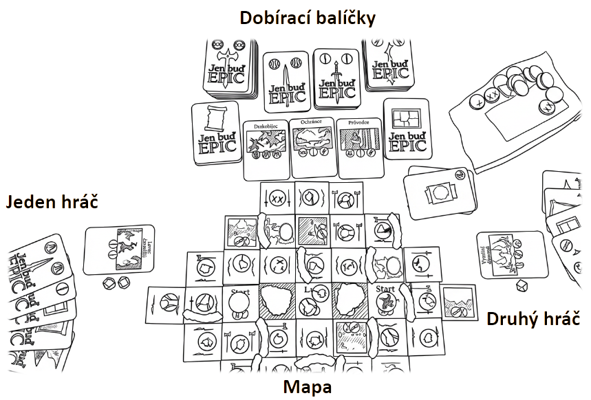

**Mapa** je rozložená uprostřed stolu. Na ní stojí vaše figurky a leží žetony příšer a vítězných bodů. Vše, co je na mapě, kde kdo stojí a jaké příšery kde jsou, je veřejné.

**Dobírací balíčky** karet leží vedle mapy. Jsou tu čtyři balíčky zbraní (kopí, palice, meče a luky) a také balíčky úkolů a předmětů. Dál jsou tu tři lícem nahoru otočené karty veřejných úkolů a odkládací balíček zahraných karet.

**Na ruce** držíte karty zbraní, předmětů a úkolů. Všechny jsou tajné, neukazujte je, pokud to pravidla nenařídí.

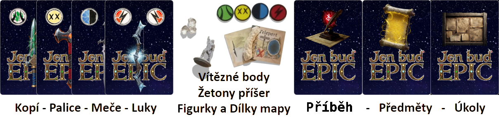

**Na stole** před sebou máte každý svou hromádku získaných vítězných bodů a karet splněných úkolů. A žetony poražených příšer - trofeje.

**Zbylé žetony** příšer čekají v losovacím váčku.

## Od zbraně k příšeře

Ve hře EPIC je každá zbraň určená k poražení konkrétní příšery. Co na koho platí, si nemusíte pamatovat, je to na rubu dobíracích balíčků zbraní. Pátou zbraní ve hře jsou bomby. Ty působí na všechny příšery bez rozdílu.

X: I na líci každé dobrané zbraně vidíš, na které příšery platí.

X: Pozor, zbraně jsou v každém balíčku namíchané. Čtvrtina zbraní v každém balíčku neodpovídá rubu.

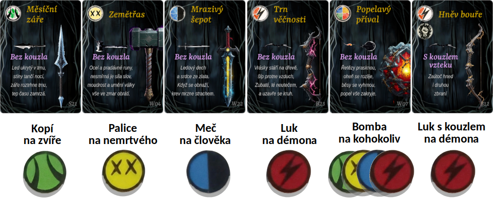

**Zvíře** je dravec, který svou nebezpečností překročil hranici toho, co místní sami umí zvládnout. Například obří lidožravý medvěd, nebo třeba početná smečka hladových vlků. Ve hře jsou to zelené žetony s rohy a platí na ně kopí.

**Nemrtvý** je souhrnný název pro mrtvolu oživenou kouzlem či prokletím. Například zombie, duch nebo kostlivec. Zde jsou to žluté žetony s křížky místo očí a platí na ně palice.

**Člověk** a ne ledajaký. Pověstná banda mordýřů nebo rozezlený čaroděj. Lidé jsou vždy někde mezi dobrem a zlem, proto mají modrý napůl plný žeton, a platí na ně meč.

**Démon** je souhrnný název pro všechno, co prošlo bránou z jiného světa. Vesničané si to zjednodušují a říkají, že přišli z pekla, ale vy víte, že míst, odkud přicházejí démoni, je mnoho. Žeton je červený, rozetlý bleskem, a platí na ně luk.

## Příprava hry

Vyberte začínajícího hráče. Bude mít oproti ostatním malou výhodu, proto vyberte někoho méně zkušeného. Hrajte po směru hodinových ručiček, takže hráč napravo od začínajícího bude hrát poslední. Jako kompenzaci bude velet stavbě mapy. Tady je pár možných tvarů mapy, jeden si vyberte.

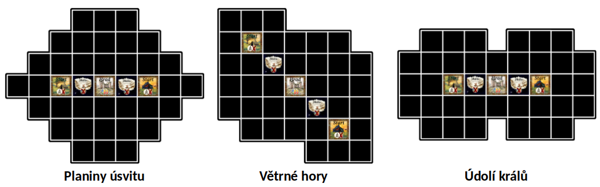

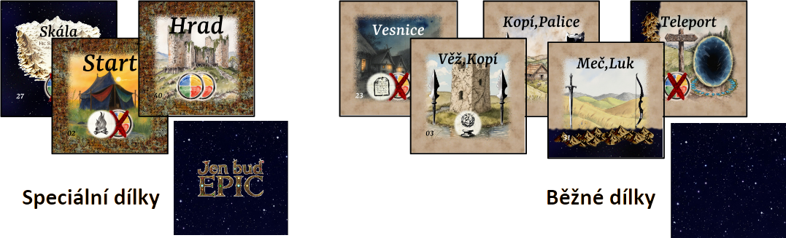

Velitel mapy vezme 5 speciálních dílků (hrad, dvě skály a dva starty) a odloží je stranou. Zbytek dílků zamíchá. Speciální dílky rozloží podle obrázku mapy. Z ostatních dílků postaví vybraný tvar. Dílky pokládá lícem nahoru a při pokládání je každý náhodně otočí. Podívejte se, jak jsou umístěné hřebeny hor, a zkontrolujte, zda není nějaké pole zcela nedostupné. Chodí se vodorovně a svisle, a přes hory chodit nejde. Pokud se na nějaký dílek nedá dojít od startu nebo teleportu, je třeba to napravit. Velitel mapy vybere, který dílek se v takovém případě pootočí. Pak přidejte miniatury skal a hor.

X: Hru připravujete všichni společně, ale při stavbě mapy rozhoduje velitel mapy.

[tabulka: NEDOVOLENÉ SITUACE MAPY]

Tahejte z váčku náhodně příšery. Na každé pole vylosujte jednu. Výjimkou je hrad, kde jsou příšery dvě. Příšery se neumísťují na pole start, skála, vesnice a teleport. Na každou příšeru položte vítězný bod.

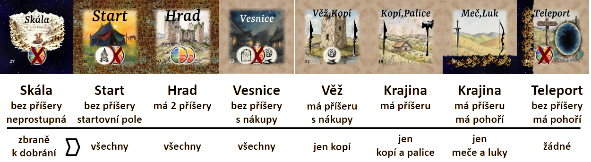

Zbylé příšery vraťte do váčku a zbylé vítězné body do krabice, už je nebudete potřebovat. Připravte a zamíchejte všech šest dobíracích balíčků karet: kopí, palice, meče, luky, předměty a úkoly.

Každý si doberte kartu povolání a "Kartu EPIC". Od začínajícího hráče si každý vybere svou figurku a zvolte, na kterém ze startů chcete začínat.

X: Volba figurky je jen estetická.

X: Můžete klidně začít všichni na stejném startu.

X: Když vybíráš kde budeš začínat, ještě nevíš jaké jsou úkoly. Znáš pouze kartu povolání. Úkoly budou překvapení pro všechny.

Pozor, teď budete vybírat počáteční zbraně. Špatný výběr vám může ztížit začátek hry. Přečtěte si nejdřív, jak se zbraně používají, viz "Tah hráče" a pak teprve dokončete přípravu.

Každý si doberte jednu kartu úkolu a jednu kartu předmětu. Poté si postupně, od začínajícího hráče, doberte své dvě počáteční zbraně. Na poli start si berte z kterýchkoli balíčků zbraní chcete, klidně každou z jiné.

H: Cesta za slávou je trnitá. Doufám, že už teď víš, že luk na kostlivce nefunguje.

X: Druhou zbraň se často vyplatí si brát, až když víš co sis doopravdy vytáhl jako tu první.

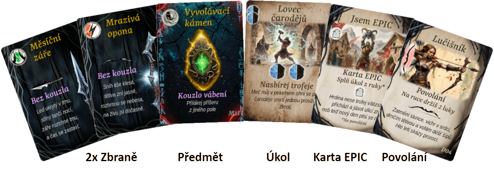

Nakonec vyložte veřejnou nabídku tří karet úkolů a hra může začít.

## Tah hráče

Hrajte postupně. Vždy hraje jeden hráč a ostatní mu do jeho tahu nezasahují. Což ale neznamená, že mu do toho nemohou mluvit. V dalších kapitolách je tah rozepsán podrobněji.

**Najděte cíl**. Podle karet zbraní, které držíte v ruce, a příšer na sousedních polích, vyberte, kam půjdete. Najděte příšeru, proti níž máte správnou zbraň. Nebo můžete jít na pole bez příšery, pokud to pro vás je výhodné. V každém případě nějakou zbraň použijete. Pokud nikam jít nechcete nebo nemůžete, **odpočíváte**. Ten případ je popsán v části "Fáze tahu 1B - Odpočinek".

H: Jde o vítězné body. Ideálně si vyber příšeru, která má u sebe také vítězný bod.

**Zaútočte a získejte odměnu**. Zbraň odhoďte. Posuňte svou figurku na dobyté pole. Vezměte si poraženou příšeru jako trofej a její vítězný bod si položte před sebe.

H: Když v ruce držíš palici a na sousedním poli vidíš nemrtvého (žlutý žeton, na ně jsou palice určené). Zahodíš palici, přesuneš se na jeho pole a vezmeš si vítězný bod i žeton nemrtvého jako trofej.

**Nakupte karty**. Přišli jste do vesnice nebo do věže? Pak teď můžete nakoupit karty úkolů a předmětů. Těchto karet můžete mít na ruce, narozdíl od zbraní, kolik chcete.

**Doberte zbraň**. Vyberte si zbraň podle toho, co je nakreslené na poli mapy, na které jste vstoupili. Doberte si kartu z příslušného balíčku. Dobíráte vždy do dvou zbraní na ruce.

**Zkontrolujte úkoly**. Pokud splňujete podmínky některého z úkolů (například máte potřebné trofeje), můžete si ho vyložit před sebe.

**Konec tahu**. Pokud se uvolnilo místo ve veřejné nabídce úkolů, doplňte ji na tři karty. Tím tah jednoho hráče končí. Zkontrolujte kolik máte vítězných bodů a splněných úkolů. Jejich součet je vaše skóre, viz "Fáze tahu 5 - Vítězství?". Pokud tím hráč ještě nevyhrál, pokračuje hra tahem dalšího hráče.

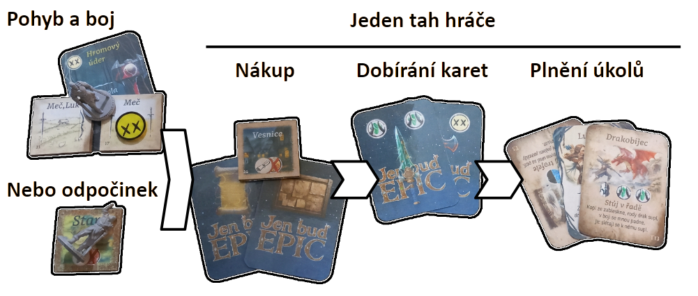

## Fáze tahu 1A - Pohyb

První fáze tahu je posunutí figurky po mapě. S figurkou táhněte o jedno pole vodorovně nebo svisle. V cestě nesmí stát hřeben hor, to je vždy nepřekonatelná překážka. Při každém pohybu musíte zahodit zbraň, i když vstupujete na pole bez příšery. Pokud na poli příšera je, musí být zbraň taková, aby příšeru porazila, viz "Od zbraně k příšeře".

H: Naběhl jsi tam a mlátil tou palicí kolem sebe, až se rozbila. Nikdo tam nebyl, tak tomu říkejme trénink, ano?

X: Hřeben hor nepřekáží, pokud máš kouzlo létání, viz "Kouzla".

X: Zbraň zahazuješ, i když jdeš na pole, kde žádná příšera není nebo třeba do vesnice.

X: Ostatní hrdinové tě v pohybu nijak neomezují. Klidně s nimi můžeš být na stejném poli.

**Pole start** je místo, kde máte svůj stan. Příšery se na to místo bojí, když se umisťují příšery tak na start je nedávejte.

X: Na každé pole, kde můžete stát, tedy i sem, můžete přivolat příšeru kouzlem vábení.

**Pole vesnice**, zde bydlí místní. Příšery se do vesnice neumisťují, ale hráči tu jsou vítaní. Je tu řada krámů, které můžete navštívit, viz "Fáze tahu 2 - Nákup".

**Pole věž** má ukrytou truhlu s kouzelným předmětem. Příšera tu sice je, ale když se jí zbavíte, můžete truhlu prozkoumat, viz "Fáze tahu 2 - Nákup".

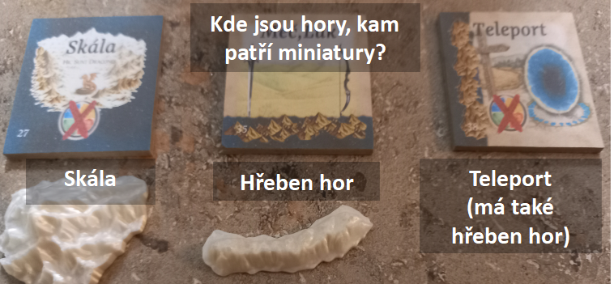

**Pole teleport** je výjimečné. Na něm nemůžete nikdy stát a nikdy na něm není příšera. Když stojíte vedle teleportu, je to, jako byste stáli vedle všech polí, sousedících se kterýmkoliv teleportem na mapě. Jako by ta pole byla hned vedle sebe. I tady nesmíte jít přes hřeben hor.

X: Projít teleportem je jako normální krok na sousední pole mapy. Odevzdáváš jednu zbraň podle příšery na poli, kam jdeš.

X: Nemůžeš vstoupit do teleportu a skončit na stejném poli, odkud si vyšel. Musíš z teleportu vystoupit na jakékoli jiné pole.

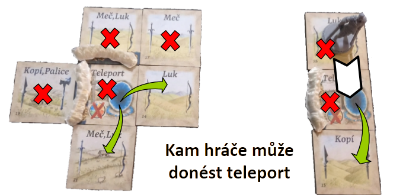

H: Skoro to vypadá, jako by tvým největším nepřítelem byly hory. S tím, co vše do boje táhneš, se vlastně není čemu divit.

**Pole skála** je také výjimečné. Přes něj se prostě chodit nijak nedá. Ani příšery se sem neodváží.

H: Tady někde žije hodně velký drak.

X: Opravdu to nejde nijak, ani kouzlem létání.

**Pole hrad** se tyčí nad okolní krajinou. Prastará zřícenina, na které straší hned dvě příšery zároveň. Zlikvidujte je a čekají vás dva vítězné body najednou. Ale potřebujete porazit obě příšery naráz. Nejde porazit jen jednu, musíte je porazit obě zároveň.

X: To znamená, že na hrad můžeš pouze, pokud máš zbraně na poražení obou příšer, které tam jsou. Na každou zbraň smíš použít kouzlo, ale není to povinné. Na tomto poli jsou příšery tak blízko u sebe, že budeš bojovat s oběma zároveň, i kdybys žádné kouzlo nepoužil.

X: Je běžné použít jednu zbraň s kouzlem tvrdosti nebo dvě různé zbraně.

## Fáze tahu 1B - Odpočinek

Pokud se nemůžete nebo nechcete pohnout po mapě, **odpočíváte** (v pokoji). Nejprve zahoďte z ruky všechny své zbývající zbraně.

Když odpočíváte vy, odpočívají i příšery. Doplňte na všechna volná pole mapy novou, náhodně vylosovanou příšeru z váčku. Nedoplňujte je na hrad, start, vesnici, teleport nebo skálu, a také ne na místa, kde stojí figurky hrdinů. Losování provádí jako odměnu odpočívající hrdina, ale může ho delegovat, pokud je někdo ochotný pomoci. Na nové příšery už nedávejte vítězné body.

Když jsou příšery doplněny, vyberte si, kde chcete odpočívat a ihned se tam přesuňte. Buď zůstaňte tam, kde jste byli, nebo se přesuňte na libovolné pole start.

H: Dobrý důvod k odpočinku je například to, když ti jiní ukradnou i poslední zbraň.

X: Odpočívat můžeš i dobrovolně.

H: Nové příšery jsou nové, žádná sláva za ně nebude. Proto nemají vítězný bod.

H: Na hradě už jsi to vymlátil. Teď se tam příšery bojí.

X: Nikdy nedávej nové příšery na hrad, start, vesnici, skálu nebo teleport. (Kromě hradu je na nich nakreslená ikonka.)

X: Nikdy nedávej novou příšeru na pole, kde stojí nějaká figurka. Včetně pole, kde stála figurka, co si šla odpočinout.

X: I když odpočíváš, děláš ostatní fáze tahu - nákup, dobrání zbraní a úkoly.

## Fáze tahu 2 - Nákup (vesnice či věž)

Ve věži a ve vesnici můžete získat novou kartu předmětu, ve vesnici navíc i kartu úkolu. Stačí abyste toto kolo přišli, prošli nebo odpočívali na tomto poli.

X: Pokud odpočíváš, nakoupit můžeš. Pokud jsi jen prošel s kouzlem vzteku, nakoupit můžeš.

X: Pokud jsi tam byl jen na začátku tahu a jen jsi toto kolo odešel pryč, tak nakoupit nestihneš.

H: Když tě sem v noci někdo teleportuje kouzlem záměny a ty jen ráno sebereš svůj ranec a utečeš, přes krámy už to nestihneš.

H: Jsou i tací, co si vesnici tak zalíbí, že si tam i další den v hostinci rádi odpočinou. Moc slávy z toho ale většinou nekouká.

**Ve věži i ve vesnici** si doberte novou kartu předmětu.

**Ve vesnici** navíc můžete dělat toto, klidně oboje.
- Jednu kartu z vyložené nabídky úkolů zahoďte na odhazovací balíček.
- Jednu kartu z vyložené nabídky úkolů, nebo nově dobranou, si vezměte na ruku jako svůj další osobní úkol.

H: Za poflakování po hospodách sláva není, jsi hrdina, a ne bard. Ale dají se tu doplnit zásoby.

H: A hele, vývěska "Hledá se hrdina". Tenhle letáček ostatní vidět nemusí, vezmu si ho, děkuji.

X: Z veřejné nabídky tedy můžeš ve vesnici odstranit až dvě karty úkolů. Nabídka se znovu doplní před tahem příštího hráče.

X: Na počet předmětů ani karet úkolů v ruce není žádný limit. Můžeš jich mít, kolik chceš.

## Fáze tahu 3 - Dobrání karet zbraní

Teď si doberte nové zbraně, abyste měli na ruce vždy dvě. První berte z balíčku zbraní podle pravidel vašeho pole mapy. Ze kterých balíčků můžete vybírat, je nakresleno přímo na poli, kde stojíte. Pokud vám chybí i druhá zbraň, doberte si ji z libovolného balíčku bez omezení.

X: Pokud ti nechybí žádná zbraň, nedobírej si žádnou.

X: Pokud vám některý dobírací balíček došel, tak už hrajete opravdu nečekaně dlouho. Nezbívá vám, než chybějící karty vytáhnout z odhazovacího balíčku.

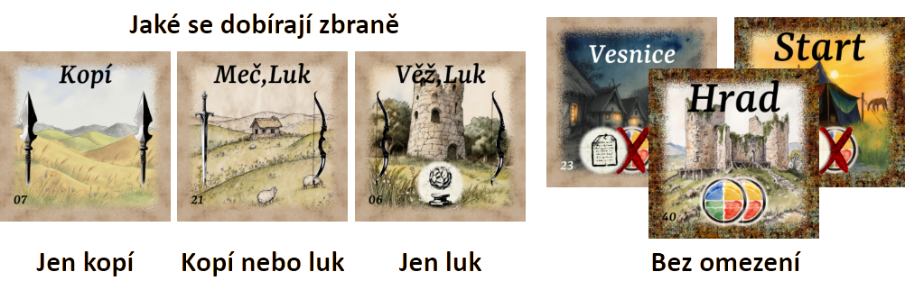

Pokud jste na poli start, hrad nebo vesnice, tak tam žádné omezení na zbraně není.

X: S kouzlem krádeže, viz "Kouzla", zbraň kradeš z ruky libovolného hráče. Tím je myšlena ta první zbraň, která by normálně podléhala omezení podle pole mapy.

Na konci tahu musíte také zahodit nadbytečné trofeje - žetony poražených příšer. Můžete si nechat maximálně tři. Zvažte, které se vám ještě budou hodit k plnění úkolů a které už ne, viz "Fáze tahu 4 - Plnění úkolů".

H: Nikdo s sebou netahá všechno a nikoho nezajímá, co jsi zapíchl před půl rokem.

## Fáze tahu 4 - Plnění úkolů

Teď, když máte akci za sebou, podívejte se na nabízené úkoly a vyhodnoťte, zda jste něco splnili. Najednou můžete splnit libovolný počet úkolů. Můžete však vybírat pouze z veřejné nabídky, svých osobních úkolů na ruce, své karty povolání a karty "Jsem EPIC". Každý splněný úkol vyložte před sebe, má stejnou hodnotu jako vítězný bod. Po vyložení splněných úkolů doplňte z dobíracího balíčku nabídku úkolů pro dalšího hráče tak, aby tam opět byly tři.

X: Opravdu můžeš splnit pouze ty úkoly, které jsi měl v nabídce ty. Že je ten nový, co jsi otočil, pro dalšího hráče super? Smůla. Tvůj už není.

X: Doplňují se jen úkoly ve veřejné nabídce. Osobní úkoly se získávají ve vesnici.

**Povolání** splníte, pokud po dobrání zbraní držíte v ruce právě ty dvě zbraně, které jsou nakreslené na kartě povolání.

H: Palice, to je panečku zbraň. Škoda, že v okolí jsou samí čarodějové a palice mi tu je k ničemu.

X: Kartu povolání máš po celou hru jen tu, kterou jsi dostal na začátku. Jinou mít nebudeš. 

**Jsem EPIC** kartu vyložte současně s první kartou úkolu, kterou vykládáte z ruky.

X: Tuto kartu máš jen jednu, od začátku hry.

X: Technicky tedy dostaneš druhý vítězný bod za první splněný osobní úkol.

X: Jsem EPIC se nevykládá s kartou povolání, pouze s kartou úkolu.

**Úkoly s trofejemi** mají na sobě pouze symboly příšer v různých kombinacích. Úkol splníte, když u sebe máte zobrazené trofeje - buď dvě stejné, nebo tři různé, podle druhu úkolu. Pro splnění úkolu stačí trofeje mít, neodevzdávají se.

X: Pro splnění úkolu "dvě trofeje zvířat" můžeš mít i jakoukoli třetí trofej, to ničemu nevadí.

**Úkoly poziční** mají na sobě kromě symbolu příšery i symbol hrdiny, případně vesnice nebo horského hřebenu. Abyste ho splnili, musíte stát na mapě ve vodorovném či svislém směru, jak je na úkolu znázorněno.

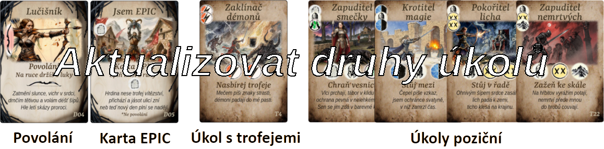

X: Musíš stát natěsno, bez mezer, musíš hned sousedit.

X: Pokud je potřebná příšera na druhé straně teleportu, pro splnění úkolu to nestačí. Teleporty jsou pro plnění úkolů překážkou. 

X: Musí to být na mapě celé vodorovně nebo celé svisle, ne do zatáčky, ne po úhlopříčce.

X: Mezi vámi nikdy nesmí být hřeben hor. 

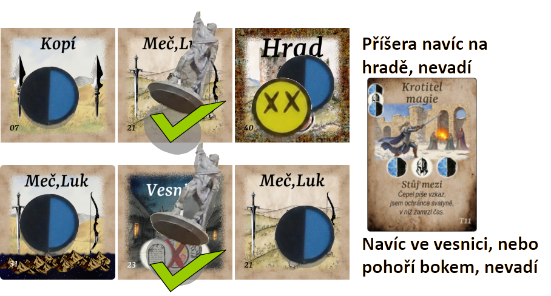
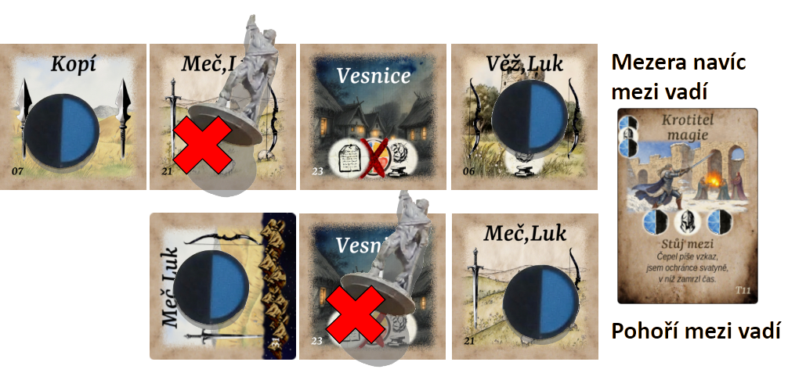

Pro úkol **"stůj mezi"** potřebujete stát mezi vyobrazenými příšerami.

Pro úkol **"stůj v řadě"** potřebujete, aby v řadě od vás stály vyobrazené příšery.

Pro úkol **"chraň vesnici"** potřebujete mít po jedné straně vesnici a po druhé vyobrazenou příšeru. Nebo stát ve vesnici, která má vedle sebe vyobrazenou příšeru. Věž nestačí, opravdu to musí být vesnice.

Pro úkol **"zažeň ke skále"** je potřeba, abyste stáli vedle příšery a těsně za ní byla skála nebo hřeben hor.

X: Pozor! Úkoly plníš až na konci kola, počítá se tvoje pozice na mapě na konci kola. Že jsi někudy proběhl, nebo tam začínal, pro splnění úkolu nestačí.

## Fáze tahu 5 - Vítězství

Vyhraje ten z vás, kdo je první opravdu slavný. Vaše skóre je součet splněných úkolů a nasbíraných vítězných bodů. Jakmile dosáhnete potřebného množství, vyhráváte. Ihned. Kolik je požadované skóre? To záleží na počtu hráčů.

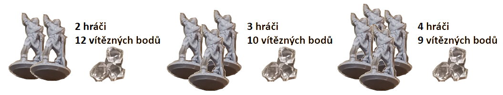

H: Je to jednoduché. Čím více vás po okolí pobíhá, tím méně slávy stačí k tomu, aby vás místní už měli opravdu dost.

## Kouzla

Kouzla jsou buď vázaná na zbraň. V tom případě jsou nakreslená přímo na kartě zbraně a působí jen na tuto zbraň. Nebo jsou volná, vázaná na kouzelný předmět a nakreslená na kartě předmětu. Taková kouzla pak působí na zbraň, se kterou předmět použijete. Kouzla používáte při pohybu po mapě. Když použijete zbraň, můžete s ní, ale nemusíte, použít i kouzlo. Žádné kouzlo není povinné. Žádnou zbraň nejde použít s více než jedním kouzlem a žádné kouzlo na zbrani nelze přenést na jinou zbraň. Kouzla mění pravidla. Pokud použijete ke zbraní kouzlo z předmětu, jednoduše odhodíte jak zbraň, tak předmět na odkládací balíček.

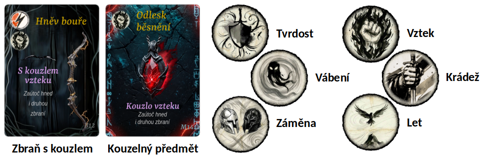

X: Zbraň, která má na sobě kouzlo, můžeš použít, jako by žádné neměla.

X: I na zbraň, která má na sobě kouzlo, můžeš místo něj použít kouzlo z předmětu. Kouzlo ze zbraně pak nemá žádný efekt.

X: Ne, nikdy! Jedna zbraň, jedno kouzlo. Víc prostě ne.

X: Můžeš mlátit do trávy (jít na pole bez příšery) a přitom použít zbraň s kouzlem.

X: Můžeš použít víc kouzel za kolo, pokud použiješ víc zbraní. Kdy se to může stát?

**Kouzlo tvrdosti** říká: "Zbraň použij, ale nezahoď". Jednoduše si ji nechte. Pokud bylo kouzlo napsáno na zbrani, pamatujte si, že z ní už kouzlo bylo vyčerpáno. Při příštím použití ji už budete muset zahodit. Pokud bylo kouzlo na předmětu, prostě zahoďte předmět a zbraň si nechte.

X: Maximálně můžete držet v ruce dvě zbraně. Nikdy víc. Ani s kouzlem tvrdosti. Novou zbraň si pak prostě nedobíráš.

X: Pokud ti někdo zbraň s vyčerpaným kouzlem sebere, kouzlo s novým majitelem zase nabere sílu a bude možné jej použít znovu.

**Kouzlo záměny** říká: "Prohoď se s jiným hrdinou." Než zbraní zaútočíte, prohoďte si místo na mapě s jiným hráčem a zaútočte, jako byste stáli na jeho původním poli.

X: Myslíš, že tímto jde někoho dostat do pěkných potíží? To si piš. Prostě se prohodíte, a v té díře, kde jsi byl doteď ty, je odteď on.

X: To znamená, že vedle jiného hráče musí být příšera, kterou touto zbraní porazíš.

**Kouzlo vábení** říká: "Přilákej příšeru z jiného pole", nějakou, kterou lze touto zbraní porazit. Tedy vemte příšeru z pole, kam útočíte, a vyměňte ji s libovolnou jinou příšerou na mapě. Zaútočte na tu novou příšeru, která teď najednou stojí vedle vás.

X: Pokud tam nějaká stála, vyměň ji s tou, co sis vybral. Vábením nemůžeš vytvořit nové pole se dvěma příšerami.

X: Přivábená příšera musí odpovídat zbrani na které toto kouzlo je. Nemůžeš mečem s vábením přilákat démona, protože démona mečem nezapíchneš.

X: S příšerami se přesouvají i jejich body slávy.

X: Lze přivábit i příšeru na původně prázdné pole.

X: Příšeru jde jen přivábit. Nemůžeš odlákat příšeru pryč a „zapíchnout“ místo ní prázdné pole.

X: Vábením můžeš prohodit, nebo odlákat, i jednu z příšer na hradě.

X: Také nejde kopím s vábením na hradě zapíchnout zvíře a pak místo druhé příšery přivábit něco, co umíš porazit svou druhou zbraní. Vždy vábíš příšeru, kterou porazíš tou zbraní, na které je kouzlo vábení. Tedy kopím můžeš vábit pouze zvíře.

**Kouzlo vzteku** říká: "Zaútoč hned i druhou zbraní". Vezmete tedy tuto zbraň, posunete se po mapě a zlikvidujete s ní příšeru. Pak vezmete svou druhou zbraň, uděláte s ní další krok po mapě a zlikvidujete druhou příšeru. Druhou zbraň musíte samozřejmě mít.

H: Je k ničemu být zuřivý, když nemáš čím se teď ohánět.

H: Viděl jsem jednu lučišnici, jak zlikvidovala démona a pak vtrhla na hrad a vymlátila to ten samý den i tam, takže tři nula pro hrdiny.

X: Tohle kouzlo ti umožňuje použít víc zbraní za kolo, získat víc bodů slávy a posunout se dále po mapě.

X: Zbraně dobíráš až potom, co dokončíš svůj pohyb. Během jednoho tahu si tedy musíš vystačit s tím, co máš na začátku tahu.

X: Abys mohl použít druhou zbraň, musíš nejprve použít tu první s kouzlem vzteku.

X: Druhá zbraň může mít své vlastní kouzlo, které se na tu první už nevztahuje.

X: Se zuřivostí můžeš po boji vtrhnout na hrad nebo z hradu po boji utéct na další pole mapy, ale obojí v jednom kole už ne.

X: Protože nikdy nemůžeš mít více než dvě zbraně, nemá smysl v jednom kole použít zuřivost podruhé.

**Kouzlo krádeže** říká: "Novou zbraň si pak vem z ruky hráče". Tohle kouzlo mění způsob, jak budete po pohybu doplňovat chybějící zbraň. Tu jednu, na kterou se vztahuje omezení pole, můžete místo z dobíracího balíčku vzít z ruky jiného hráče. Jakýkoliv druh zbraně od jakéhokoliv hráče.

H: Tím myslím na jakoukoli vzdálenost a opravdu jakoukoli zbraň, omezení pole ignoruj.

X: Vybíráš si kartu, nikoliv zbraň. Cílený hráč ti ukáže pouze zadní strany karet. Nemusí ti říkat, že to, co vypadá jako palice, je ve skutečnosti luk, ani jestli má kouzlo či ne.

**Kouzlo létání** říká: "Přejdi přes hřeben hor". Tohle kouzlo mění způsob, jak můžete chodit po mapě. Při tomto jednom útoku zbraní můžete ignorovat případný jeden hřeben hor v cestě.

X: Ale jen pro tento útok. Pro plnění úkolů tam už ten hřeben hor opět je.

X: Pole skála pořád přejít nejde.

X: Samozřejmě, příšeru za těmi horami musíš vybranou zbraní porazit.

## Jak hrát víc her

EPIC není strategická hra na celý večer. Aby byla hra férová, měla by se hrát opakovaně, například na dvě vítězné hry. První hru začíná ten, koho určíte. Každou další hru pak zahajuje ten, kdo hraje hned po hráči, který předchozí hru vyhrál. Prostě tak, aby ten, kdo minulou hru vyhrál, hrál novou hru jako poslední. První, kdo vyhraje dvě hry, vítězí v celém turnaji.

Další možnost je hrát na trestné body. Dostanete tolik trestných bodů, kolik vám po hře chybí k vítězství. A celý turnaj vyhraje ten z vás, kdo má nakonec v součtu trestných bodů nejméně.

## Slovo závěrem

Naše hra se snaží překlenout ten most mezi hráči, kteří rádi plánují a hráči, kteří chtějí hlavně vzít palici a něco s ní EPICky praštit. Vývojem, přípravou a testováním této hry jsme strávili spoustu času a zažili jsme u toho ohromné množství zábavy. Tak vám přejeme, ať hra baví i vás. V této hře lze hodně plánovat a bez pochyby to má vliv na výsledek. Míra náhody a chaosu je však také velká, takže šanci vyhrát máte opravdu všichni. A přesně tak jsme to chtěli. Tak ti, hrdino, přeju, ať se ti hra líbí a ať jsi dnes nejvíc EPIC právě ty.

H: Copak v tom balíčku luků není jedinej luk?!

H: Když budu kouzlem vábení pořád lákat příšery do vesnice, určitě budu brzy velmi slavná.

H: Nechali ste mi jen jedinou zbraň lumpové, ale já ten hrad stejně dobiju, ona je to totiž tvrdá bomba!

H: Neuvěříte, co jsem dneska viděl. Proběhla tudy barbarská válečnice. Šel jí kouř z uší, rozbila si meč o výlohu v obchodě s kouzelnými předměty, a tak se chopila obrovského kladiva a s křikem běžela dál, kamsi za humna.
